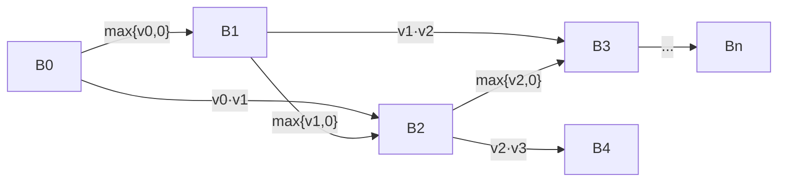

# Introduction to Algorithms: 6.006

## <span style="color:#2471a3;">**[lecture]**</span> <span style="color:#c0392b">Lecture 15: Dynamic Programming, Part 1 — SRT BOT, Fibonacci, DAGs, Bowling（动态规划第一讲）</span>

Massachusetts Institute of Technology
Instructors: Erik Demaine, Jason Ku, and Justin Solomon

---

## <span style="color:#2471a3;">**[section]**</span> <span style="color:#c0392b">引言：从"会用算法"到"设计算法"</span>

讲师点明课程转折：前半学期是 **existing algorithms（已有算法）**——排序、graph algorithms（图算法）、data structures（数据结构），你学会用它们解题；从今天开始进入 **algorithmic design（算法设计）**——面对一个从未见过的问题，从零构思 polynomial time algorithm（多项式时间算法）。

核心思想是 **recursive algorithm design（递归算法设计）**：
- 我们想要 constant-sized code（恒定大小的代码）解决 arbitrary size problems（任意规模的问题）
- recursive view（递归视图）特别契合 induction technique（归纳法证明）——这门课一直在用的证明技术
- 递归调用构成 **subproblem graph（子问题图）**，这是分析递归算法的核心工具

> <span style="color:#1e8449;">**[note] Note（译者注）:**</span> 🎥 *Demaine 在视频中以轻松的口吻开场*："Today we start a totally new section of the class... how to from scratch come up with a polynomial time algorithm." *他强调这是从"使用已知算法"到"设计新算法"的思维跃迁。*

---

## <span style="color:#2471a3;">**[section]**</span> <span style="color:#c0392b">SRT BOT 框架——递归算法设计的六步法</span>

SRT BOT（读作 **SortBot**）是本讲的核心框架。🎥 *Ku 调侃说这是他们苦思冥想编出的 acronym（缩写词），便于记忆完整的递归算法设计规范。* 按顺序执行以下六步，就能完整定义任何递归算法：

### <span style="color:#2471a3;">**[step]**</span> <span style="color:#c0392b">Step 1: Subproblems（子问题定义）</span>

> <span style="color:#1e8449;">**[note] Note（译者注）:**</span> 🎥 *Ku 在视频中坦言*："The hardest part, usually, in defining a recursive algorithm is figuring out what the subproblems should be." *这是整个六步中最有创造性的一步。子问题通常选取输入的 subsets（子集），如 prefixes（前缀）、suffixes（后缀）、contiguous substrings（连续子串），且必须保证 polynomial number（多项式数量）。*

描述子问题的含义，明确 parameters（参数）。

### <span style="color:#2471a3;">**[step]**</span> <span style="color:#c0392b">Step 2: Relate（递推关系）</span>

```math
x(i) = f\big(x(j), \dots\big) \text{ for one or more } j < i
```

将较大子问题通过较小子问题表达。🎥 *一个实用的设计原则：对于 suffix-based 子问题，考虑**第一个元素**能做什么；对于 prefix-based 子问题，考虑**最后一个元素**能做什么。*

### <span style="color:#2471a3;">**[step]**</span> <span style="color:#c0392b">Step 3: Topological order（拓扑序）</span>

Subproblem dependencies（子问题依赖）必须构成 DAG。如果有 cycle（循环），递归调用永不终止。🎥 *Ku 说*："Often it's just a for loop. Just do it in this order."

### <span style="color:#2471a3;">**[step]**</span> <span style="color:#c0392b">Step 4: Base cases（基例）</span>

递推关系的 termination condition（终止条件）。任何递归结构都必须有 base cases。

### <span style="color:#2471a3;">**[step]**</span> <span style="color:#c0392b">Step 5: Original problem（原问题）</span>

说明如何从子问题解组装出原问题解。可能需要 parent pointers（父指针）恢复 actual solution（实际方案）而非仅 objective function（目标函数）值。

### <span style="color:#2471a3;">**[step]**</span> <span style="color:#c0392b">Step 6: Time analysis（时间复杂度分析）</span>

```math
\sum_{x \in X} \text{work}(x)
```

若对所有子问题 $\text{work}(x) = O(W)$ 则简化为 $|X| \cdot O(W)$。$\text{work}(x)$ 只衡量**非递归**工作量，递归调用视为 $O(1)$。

---

## <span style="color:#2471a3;">**[section]**</span> <span style="color:#c0392b">案例一：归并排序的 SRT BOT 表达</span>

🎥 *将熟悉的 Merge Sort（归并排序）套入 SRT BOT 框架作为第一个示范。*

- **Subproblems:** $S(i, j) =$ sorted array on $A[i : j]$ for $0 \le i \le j \le n$
- **Relation:** $S(i, j) = \text{merge}\big(S(i, m), S(m, j)\big)$ where $m = \lfloor (i + j)/2 \rfloor$
- **Topo. order:** Increasing $j - i$（按子数组长度递增）
- **Base cases:** $S(i, i + 1) = [A[i]]$
- **Original:** $S(0, n)$
- **Time:** $T(n) = 2 T(n/2) + O(n) = O(n \log n)$

> 子问题 DAG 是 tree（树型）——divide & conquer（分治）。归并排序的子问题**不重叠**，因此不需要 memoization。

---

## <span style="color:#2471a3;">**[section]**</span> <span style="color:#c0392b">案例二：斐波那契数列——Memoization 的威力</span>

### <span style="color:#2471a3;">**[example]**</span> <span style="color:#c0392b">朴素递归：指数级灾难</span>

Fibonacci 数列由递推 $F_n = F_{n-1} + F_{n-2}$ 定义，🎥 *Demaine 说*："This is a recurrence, so it seems very natural to write it as a recursive algorithm."

```python
def fib(n):
    if n < 2: return n
    return fib(n-1) + fib(n-2)
```

按 SRT BOT：
- **Subproblems:** $F(i) = F_i$ for $i \in \{0, \dots, n\}$
- **Relation:** $F(i) = F(i-1) + F(i-2)$
- **Topo. order:** Increasing $i$
- **Base cases:** $F(0)=0, F(1)=1$
- **Original:** $F(n)$
- **Time:** $T(n) = T(n-1) + T(n-2) + O(1)$

$T(n)$ 的递推式与 Fibonacci 本身相同，$T(n) = \Theta(\phi^n)$，其中 $\phi = (1+\sqrt{5})/2 \approx 1.618$——**指数级**。🎥 *Demaine 戏谑地说*："That's bad. Exponential growth is bad."

### <span style="color:#2471a3;">**[insight]**</span> <span style="color:#c0392b">问题根源：子问题重复计算</span>

🎥 *Demaine 生动地描述道*："So to compute $F(n-1)$, I need $F(n-3)$. And also to compute $F(n-2)$, I need $F(n-3)$. So why are we computing it twice? Let's just do it once."

递归展开后，$F(k)$ 被重复计算了 $F(n-k)$ 次——本质上是在把 DAG 展开成 tree 来遍历。

### <span style="color:#2471a3;">**[section]**</span> <span style="color:#c0392b">Memoization（记忆化）——DP 的核心思想</span>

🎥 *Demaine 强调*："It's not a big idea. It **IS** the big idea of dynamic programming. ... Instead of memorization, it's **memoization**, because we're going to write things down in a memo pad."

核心就一件事：**remember and reuse solutions to subproblems**（记住并复用于问题解）。用一个 dictionary（备忘录）记录已计算的子问题结果，下次直接查表。

```python
def fib(n):
    memo = {}
    def F(i):
        if i < 2: return i
        if i not in memo:
            memo[i] = F(i-1) + F(i-2)
        return memo[i]
    return F(n)
```

> <span style="color:#1e8449;">**[note] Note（译者注）:**</span> 🎥 *Demaine 用递归展开图解释了为什么 memoization 如此有效：* "In this recursion, after we've called $F(i-1)$, it will have already computed $F(i-2)$. So while this call is recursive, this one will immediately terminate because $i-2$ will already be in the memo table. We'll just have recursion down the left branch, and all the right branches will be free."——这意味着只有**左链**真的在递归，所有右分支都是 $O(1)$ 查表，总时间 $O(n)$。

**Bottom-up 版本（按拓扑序迭代）：**

```python
def fib(n):
    F = {}
    F[0], F[1] = 0, 1
    for i in range(2, n + 1):
        F[i] = F[i-1] + F[i-2]
    return F[n]
```

> <span style="color:#7f8c8d;">**subtlety（微妙之处）：** Fibonacci 数增长到 $\Theta(n)$ bits，可能超过 word size $w$。每次加法需 $O(\lceil n/w\rceil)$ 时间，总代价为 $O(n \lceil n/w\rceil) = O(n + n^2 / w)$。</span>

---

## <span style="color:#2471a3;">**[section]**</span> <span style="color:#c0392b">动态规划的本质</span>

"Dynamic Programming" 这个名字是 Richard Bellman 为了申请政府资助而故意起的"酷炫"名字——他需要掩盖自己在做数学的事实。"Programming" 指制定计划（如 linear programming），"Dynamic" 指更新。

**三个核心特征：**
1. Recursion exists（存在递归解）——子问题可分解
2. Overlapping subproblems（子问题重叠）——DAG 中 in-degree $> 1$
3. Optimal substructure（最优子结构）——最优解由子问题最优解构成

Demaine 对 DP 的经典描述：**"Careful brute force"（精巧的暴力）**。

> <span style="color:#1e8449;">**[note] Note（译者注）——第一性原理洞察：** DP 为什么是"精巧的暴力"? 传统 brute force（暴力搜索）尝试所有可能性，每层 $\times$ 分支，指数爆炸。DP 也是尝试所有可能性，但关键差异在于它事先定义了一个**多项式大小的子问题空间**，并保证**每一步的局部决策只依赖于这些子问题的解**。指数级的搜索路径被压缩到多项式时间——因为"精心地"选择了子问题来捕获所有必要信息。这不是魔法，而是选择了正确的 abstraction level（抽象层级）。</span>

---

## <span style="color:#2471a3;">**[section]**</span> <span style="color:#c0392b">子问题设计工具箱：序列输入的三种模式</span>

🎥 *Ku 提供了针对 sequence（序列）输入的子问题设计模板：*

| 模式 | 定义 | 数量 | 思考方式 |
|---|---|---|---|
| **Prefixes（前缀）** | $x[0:i]$ for all $i$ | $\Theta(n)$ | 考虑**最后一个元素** |
| **Suffixes（后缀）** | $x[i:n]$ for all $i$ | $\Theta(n)$ | 考虑**第一个元素** |
| **Substrings（子串）** | $x[i:j]$ for all $i \le j$ | $\Theta(n^2)$ | 考虑**中间某个元素** |

> <span style="color:#c0392b;">**🚨 禁止：** Subsequences（子序列）有 $2^n$ 种，永远不要用它作为子问题空间。</span>

Prefixes 和 suffixes 通常够用且是线性数量，比二次型的 substrings 更优。本节保龄球问题用 suffixes 即可解决。

---

## <span style="color:#2471a3;">**[section]**</span> <span style="color:#c0392b">案例三：DAG 最短路径——作为 DP 的图算法</span>

将 DAG SSSP（单源最短路径）重新解释为 DP：

- **Subproblems:** $\delta(s, v)$ for all $v \in V$
- **Relation:** $\delta(s, v) = \min\big\{\delta(s, u) + w(u, v) \mid u \in \text{Adj}^-(v)\big\} \cup \{\infty\}$
- **Topo. order:** Topological order of $G$
- **Base cases:** $\delta(s, s) = 0$
- **Original:** All subproblems
- **Time:** $\displaystyle\sum_{v \in V} O(1 + |\text{Adj}^-(v)|) = O(|V| + |E|)$

> **两种视角的等价性：** DAG Relaxation 是"从 $u$ 出发推送到邻居"（$\text{Adj}^+$ 视角），SRT BOT 版 DP 是"从 $v$ 收集所有入边"（$\text{Adj}^-$ 视角）。数学上完全等价。

---

## <span style="color:#2471a3;">**[section]**</span> <span style="color:#c0392b">案例四：保龄球问题——完整 DP 设计</span>

### <span style="color:#2471a3;">**[problem]**</span> <span style="color:#c0392b">问题描述</span>

🎥 *Demaine 介绍：* "Bowling is popular in Boston... Today we're going to play an even more unusual bowling game, one that I made up based on a puzzle Henry Dudeney made up in 1908."

给定 $n$ 个 bowling pins（球瓶）排成一行，球瓶 $i$ 有分值 $v_i$（可正可负）。一次投球可击倒：
- **1 个球瓶** $i$，得 $v_i$ 分
- **2 个相邻球瓶** $i$ 和 $i+1$，得 $v_i \cdot v_{i+1}$ 分

可跳过不击，每瓶只能击一次。**目标：** 最大化总得分。

**示例：** $v = [-1, 1, 1, 1, 9, 9, 3, -3, -5, 2, 2]$

> 例中 $9 \times 9 = 81$ 很诱人，$-5 \times -5 = 25$ 也值得。相邻负数相乘反而赚分。

### <span style="color:#2471a3;">**[solution]**</span> <span style="color:#c0392b">SRT BOT 设计</span>

**Subproblems:** $B(i) =$ 仅考虑球瓶 $i, i+1, \dots, n-1$ 的最大得分（suffix）

**Relation:** 考虑第一个球瓶 $i$ 的三种选择。🎥 *Demaine 的核心洞见：* "The big idea here is to just think about... what could I do to pin i?"

1. **跳过** $i$：$B(i+1)$
2. **单独击倒** $i$：$v_i + B(i+1)$
3. **与 $i+1$ 一起击倒**：$v_i \cdot v_{i+1} + B(i+2)$

```math
B(i) = \max\big\{B(i+1),\; v_i + B(i+1),\; v_i \cdot v_{i+1} + B(i+2)\big\}
```

**Topo. order:** Decreasing $i$（从 $n$ 递减到 $0$）

**Base cases:** $B(n) = B(n+1) = 0$

**Original:** $B(0)$

**Time:** $\Theta(n)$ 子问题 $\times \Theta(1)$ 每个 $= \Theta(n)$

**子问题 DAG（maximum-weight path）：**



> <span style="color:#1e8449;">**[note] Note（译者注）——Local Brute Force（局部暴力枚举）：** 这个术语是本节课的核心洞见。我们只对**第一个球瓶**进行 local brute force（三种选择），不需要同时考虑所有球瓶。因为一旦决定了第一个球瓶的命运，剩下的仍然是同一个问题的更小实例（suffix）。这种"局部暴力 + 全局复用"的模式正是 DP 的精髓。🎥 *Demaine 对此颇为感慨：* "This is almost a trivial algorithm. It's amazing that this solves the bowling problem. Normally if I tried all the options... that would be exponential, $3 \times 3 \times 3$, that's bad. But because I can reuse these subproblems, it turns out to only be linear time. It's almost like magic."</span>

### <span style="color:#2471a3;">**[code]**</span> <span style="color:#c0392b">代码实现</span>

**Top-down（recursion + memoization）：**

```python
def bowl(v):
    memo = {}
    def B(i):
        if i >= len(v): return 0
        if i not in memo:
            memo[i] = max(B(i+1),
                         v[i] + B(i+1),
                         v[i] * v[i+1] + B(i+2))
        return memo[i]
    return B(0)
```

**Bottom-up（迭代——讲师推荐写法）：**

🎥 *Demaine 明确推荐 bottom-up 实现：* "If I were going to implement this algorithm, I would write it this way. Because this is super fast. No recursive calls, just one for loop."

```python
def bowl(v):
    B = {}
    B[len(v)] = 0
    B[len(v)+1] = 0
    for i in reversed(range(len(v))):
        B[i] = max(B[i+1],
                   v[i] + B[i+1],
                   v[i] * v[i+1] + B[i+2])
    return B[0]
```

---

## <span style="color:#2471a3;">**[section]**</span> <span style="color:#c0392b">方法论总结：如何写出递推关系</span>

🎥 *Demaine 总结出写递推关系的通用范式：*

1. **Identify a feature（识别关键特征）**：如果知道了某个 key decision（关键决策），就能归约到更小的子问题
2. **Local brute force（局部暴力）**：枚举该决策的所有可能，取 best
3. **Polynomial constraint（多项式约束）**：确保决策空间是多项式级

>Suffix 问题的标准技巧：**考虑第一个元素，枚举它能做的所有事。** Prefix 问题同理：考虑最后一个元素。

> <span style="color:#1e8449;">**[note] Note（译者注）——跨课程连接 CLRS 第 15 章：** 保龄球问题本质上是 CLRS 中 rod cutting（钢条切割）的变体。两者都是 suffix-based DP，递推形式一致：$B(i) = \max_k\{\text{value}_k + B(i+k)\}$。区别在于保龄球多了一个"跳过"选项。这种"第一个元素怎么处理"的 pattern 是 suffix-based DP 的标志性结构，在 CLRS 的 DP 章节中反复出现。</span>

---

> <span style="color:#7f8c8d;">*MIT OpenCourseWare* | *https://ocw.mit.edu* | *6.006 Introduction to Algorithms, Spring 2020*</span>
> <span style="color:#7f8c8d;">*Lecture video: "24-15. Dynamic Programming, Part 1" on Bilibili (DownKyi download)*</span>
