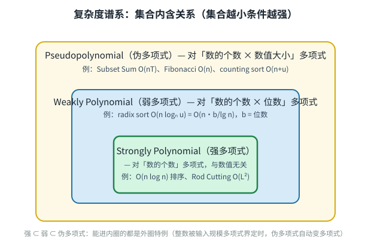

# Introduction to Algorithms: 6.006

## <span style="color:#2471a3;">**[lecture]**</span> <span style="color:#c0392b">Lecture 18: Pseudopolynomial — Rod Cutting, Subset Sum（动态规划第四讲：伪多项式时间——切杆、子集和）</span>

Massachusetts Institute of Technology
Instructors: Erik Demaine, Jason Ku, and Justin Solomon

> <span style="color:#7f8c8d;">MIT 6.006 Spring 2020, Lecture 18 讲义（对应视频：Dynamic Programming, Part 4 — Rods, Subset Sum, Pseudopolynomial）</span>

---

## <span style="color:#2471a3;">**[section]**</span> <span style="color:#c0392b">Dynamic Programming Steps（SRT BOT 六步法回顾）</span>

本讲是 dynamic programming（动态规划）四讲中的**最后一讲**，主题转向一个新的复杂度概念——pseudopolynomial time（伪多项式时间）。🎥 *Demaine 开场点明本讲主线*："This is going to lead us to a new notion called pseudopolynomial time."（翻译：这会把我们引向一个叫伪多项式时间的新概念。） *他随即强调，本课一贯视 polynomial time（多项式时间）为好的运行时间，而 pseudopolynomial（伪多项式）同样是相当不错的运行时间——并预告今天只讲两个新例子 rod cutting（切杆）与 subset sum（子集和），随后从"对角线视角"回顾全课所有 DP 例子。*

先快速回顾 SRT BOT 框架的六步：

**Step 1: Subproblem definition（子问题定义）**——子问题 $x \in X$：

- 用参数描述子问题的含义
- 通常取输入的 subsets（子集）：sequences（序列）的 prefixes（前缀）、suffixes（后缀）、contiguous substrings（连续子串）
- 对多个输入，常取各子集空间的 product（笛卡尔积）
- 常记录 partial state（部分状态）：通过递增辅助变量扩展子问题
- **常取比给定整数更小的整数**（今日焦点）

**Step 2: Relate subproblem solutions recursively（递归关联子问题解）**

```math
x(i) = f(x(j), \ldots) \quad \text{for one or more } j < i
```

- 找出一个关于子问题解的 question（问题）：如果知道它的答案，就能把当前子问题归约为更小的子问题
- 对问题的所有可能答案做 locally brute-force（局部暴力枚举）

**Step 3: Topological order（拓扑序）**——论证递推关系是无环的，子问题构成 DAG（有向无环图）

**Step 4: Base cases（基础情形）**

- 给出所有（可达的）独立子问题的解——递推关系在这些子问题上不再适用

**Step 5: Original problem（原问题）**

- 说明如何从子问题的解计算原问题的解
- 可能要用 parent pointers（父指针）恢复实际方案，而不只是目标函数值

**Step 6: Time analysis（时间分析）**

```math
\sum_{x \in X} \text{work}(x) \quad \text{；若对所有 } x \in X \text{ 有 } \text{work}(x) = O(W)，\text{则总时间为 } |X| \cdot O(W)
```

- $\text{work}(x)$ 度量递推中的非递归工作量；递归调用视为 $O(1)$ 时间

> <span style="color:#7f8c8d;">SRT BOT 框架六步的完整叙述见 L15（lec15-recursive-algorithms.bilingual.md）；子问题扩展专题见 L16/L17。</span>

---

## <span style="color:#2471a3;">**[section]**</span> <span style="color:#c0392b">Rod Cutting（切杆问题）</span>

- **输入**：一根长度为 $L$ 的 rod（杆），以及每段长度 $\ell$ 的价值 $v(\ell)$，对所有 $\ell \in \{1, 2, \ldots, L\}$
- **目标**：切割这根杆，使切出的各段价值之和最大
- **例子**：$L = 7$，$v = [0, 1, 10, 13, 18, 20, 31, 32]$

```text
  ℓ = 0   1    2    3    4    5    6    7
```

- 也许可以贪心地选单位长度价值最高的切法？
- **不行！** $\arg\max_{\ell} v[\ell]/\ell = 6$，而切成 $[6, 1]$ 得到 $32$，并非最优！
- **最优解**：$v[2] + v[2] + v[3] = 10 + 10 + 13 = 33$
- 这是一个在 partition（划分）上的 maximization problem（最大化问题）

### <span style="color:#2471a3;">**[step]**</span> <span style="color:#c0392b">1. Subproblems（子问题）</span>

- $x(\ell)$：切一根长度为 $\ell$ 的杆能得到的最大价值
- 对所有 $\ell \in \{0, 1, \ldots, L\}$

### <span style="color:#2471a3;">**[step]**</span> <span style="color:#c0392b">2. Relate（递推）</span>

- 第一段的长度是某个 $p$（Guess!（猜！））
- $x(\ell) = \max\{v(p) + x(\ell - p) \mid p \in \{1, \ldots, \ell\}\}$
- （画出依赖图）

### <span style="color:#2471a3;">**[step]**</span> <span style="color:#c0392b">3. Topological order（拓扑序）</span>

- 递增的 $\ell$：子问题 $x(\ell)$ 只依赖严格更小的 $\ell$，因此无环

### <span style="color:#2471a3;">**[step]**</span> <span style="color:#c0392b">4. Base（基础情形）</span>

- $x(0) = 0$（长度为 0 的杆没有价值！）

### <span style="color:#2471a3;">**[step]**</span> <span style="color:#c0392b">5. Original problem（原问题）</span>

- 切一根长度为 $L$ 的杆能得到的最大价值就是 $x(L)$
- 存储选择以重构切割方案
- 若当前杆长为 $\ell$、最优选择是 $\ell_0$，则切出的段为 $p = \ell - \ell_0$
- （子问题 DAG 中的最大权路径！）

### <span style="color:#2471a3;">**[step]**</span> <span style="color:#c0392b">6. Time（时间）</span>

- 子问题数：$L + 1$
- 每个子问题的工作量：$O(\ell) = O(L)$
- 运行时间：$O(L^2)$

> <span style="color:#7f8c8d;">CLRS §15.1（Rod Cutting），讲义第 2 页。</span>

---

## <span style="color:#2471a3;">**[section]**</span> <span style="color:#c0392b">这是多项式时间吗？（Is This Polynomial Time?）</span>

- （强）多项式时间（(strongly) polynomial time）意味着：运行时间被输入大小（以 word（机器字）为单位计量）的一个常数次多项式从上方界定
- 在 Rod Cutting 中，输入大小是 $L + 1$ 个 words（一个整数 $L$ 和 $v$ 中的 $L$ 个整数）
- $O(L^2)$ 是 $L + 1$ 的常数次多项式，所以**是的：（强）多项式时间**

> <span style="color:#1e8449;">**[note] Note（译者注）:**</span> 为什么切杆是"强"多项式、而子集和不是？关键差别在**输入里有多少个整数**。切杆的输入里光价值数组就有 $L$ 个数，输入大小本身随 $L$ 线性增长，于是以 $L$ 为参数的 $O(L^2)$ 自动就是输入规模的多项式。而子集和的输入里那个巨大的目标值 $T$ **只占一个 word**——输入的"大小"由 $n$（数组元素个数）主导，$T$ 再大也只算一个数。于是以 $T$ 为参数的 $O(nT)$ 不一定随输入大小多项式增长。🎥 *Demaine 在视频里点破 word 度量的实质*："we assume that all the things we're manipulating fit in a machine word... the natural way to measure the size of an input."（翻译：我们假定所有操作对象都能装进一个机器字……这是度量输入大小的自然方式。） 这背后是你在 CSAPP 里反复接触的 word RAM 模型：机器字是内存寻址与算术的基本单元，两个数相加被当作 $O(1)$，前提是它们各自装得进一个字。word 模型下每个数占 $O(1)$ 空间，所以"输入大小"数的是**数的个数**而不是数的**二进制位数**——正是这个"位数不算数"的约定，埋下了"伪多项式"一词的全部根源（unary vs binary 编码如何放大输入大小的机制见下页注 3）。现实注脚：rod cutting 的近亲是 cutting stock problem（下料问题）——纸张、钢材、木材厂把原料卷/板切成一批指定尺寸的订单、最小化浪费（Knapsack 的维基词条将 "least wasteful way to cut raw materials"（最省原料的切割方式）列为头号应用）。但严格说它是**多原料配多订单**的变体（近似 bin packing，工业上靠 column generation（列生成）解），与切杆的"单杆 + 单价值函数"一维模型**同族不同骨架**——把下料问题硬塞进本讲的 $O(L^2)$ DP 会失效，这正是 Knapsack 推广两者的伏笔（见 recitation）。

```python
# recursive
x = {}
def cut_rod(l, v):
    if l < 1:   return 0                                        # base case
    if l not in x:                                              # check memo
        for piece in range(1, l + 1):                           # try piece
            x_ = v[piece] + cut_rod(l - piece, v)               # recurrence
            if (l not in x) or (x[l] < x_):                     # update memo
                x[l] = x_
    return x[l]
```

```python
# iterative
def cut_rod(L, v):
    x = [0] * (L + 1)                                           # base case
    for l in range(L + 1):                                      # topological order
        for piece in range(1, l + 1):                           # try piece
            x_ = v[piece] + x[l - piece]                        # recurrence
            if x[l] < x_:                                       # update memo
                x[l] = x_
    return x[L]
```

```python
# iterative with parent pointers
def cut_rod_pieces(L, v):
    x = [0] * (L + 1)                                           # base case
    parent = [None] * (L + 1)                                   # parent pointers
    for l in range(1, L + 1):                                   # topological order
        for piece in range(1, l + 1):                           # try piece
            x_ = v[piece] + x[l - piece]                        # recurrence
            if x[l] < x_:                                       # update memo
                x[l] = x_
                parent[l] = l - piece                           # update parent
    l, pieces = L, []
    while parent[l] is not None:                                # walk back through parents
        piece = l - parent[l]
        pieces.append(piece)
        l = parent[l]
    return pieces
```

> <span style="color:#7f8c8d;">三段代码对应讲义第 3 页：recursive（自顶向下 + memoization）、iterative（自底向上）、iterative with parent pointers（自底向上 + 父指针回溯重构切割方案）。</span>

---

## <span style="color:#2471a3;">**[section]**</span> <span style="color:#c0392b">Subset Sum（子集和）</span>

- **输入**：$n$ 个正整数组成的序列 $A = \{a_0, a_1, \ldots, a_{n-1}\}$
- **输出**：是否存在 $A$ 的一个子集恰好和为 $T$？（即是否存在 $A' \subseteq A$ 使得 $\sum_{a \in A'} a = T$？）
- **例子**：$A = (1, 3, 4, 12, 19, 21, 22)$，$T = 47$ 可取 $A' = \{3, 4, 19, 21\}$
- **优化问题？不，是判定问题（decision problem）！** 答案只有 YES（是）或 NO（否），TRUE（真）或 FALSE（假）
- 例中答案是 YES。但对其他一些 $T$（例如 $T = 2, 6, 9, 10, 11, \ldots$），答案则是 NO

### <span style="color:#2471a3;">**[step]**</span> <span style="color:#c0392b">1. Subproblems（子问题）</span>

- $x(i, t)$ = $A[i:]$ 的某个子集能否恰好和为 $t$？
- 对所有 $i \in \{0, 1, \ldots, n\}$，$t \in \{0, 1, \ldots, T\}$

### <span style="color:#2471a3;">**[step]**</span> <span style="color:#c0392b">2. Relate（递推）</span>

- **思路**：第一个元素 $a_i$ 在不在一个合法子集 $A'$ 里？（Guess!（猜！））
- 若在，则用剩余元素凑出 $t - a_i \ge 0$
- 若不在，则用剩余元素凑出 $t$

```math
x(i, t) = \text{OR} \begin{cases} x(i + 1, t - A[i]) & \text{if } t \ge A[i] \\ x(i + 1, t) & \text{always} \end{cases}
```

### <span style="color:#2471a3;">**[step]**</span> <span style="color:#c0392b">3. Topological order（拓扑序）</span>

- 子问题 $x(i, t)$ 只依赖严格更大的 $i$，所以无环
- 按递减的 $i$ 求解

### <span style="color:#2471a3;">**[step]**</span> <span style="color:#c0392b">4. Base（基础情形）</span>

- $x(i, 0) = \text{YES}$，对所有 $i \in \{0, \ldots, n\}$（空间被恰好装满！）
- $x(n, t) = \text{NO}$，对所有 $t \in \{1, \ldots, T\}$（没有剩余元素可装）

### <span style="color:#2471a3;">**[step]**</span> <span style="color:#c0392b">5. Original problem（原问题）</span>

- 原问题由 $x(0, T)$ 给出
- **例子**：$A = (3, 4, 3, 1)$，$T = 6$ 的解：$A' = (3, 3)$
- Bottom-up（自底向上）：求解全部子问题（该例有 35 个）
- **Top-down（自顶向下）**：只求解可达的子问题（该例只有 14 个！）

### <span style="color:#2471a3;">**[step]**</span> <span style="color:#c0392b">6. Time（时间）</span>

- 子问题数：$O(nT)$，每个子问题 $O(1)$ 工作量
- 总时间：$O(nT)$

> <span style="color:#1e8449;">**[note] Note（译者注）:**</span> 注意讲义例子中 bottom-up 的 35 与 top-down 的 14 之差：$A = (3,4,3,1)$、$T = 6$ 时，子问题空间是 $(n+1)(T+1) = 5 \times 7 = 35$ 格，但真正从 $x(0,6)$ 可达的只有 14 格——因为大部分"大 $t$ 配小后缀"的组合永远走不到。（自己枚举一遍会更清楚：从 $(0,6)$ 出发按递推展开，可达状态共 15 个，其中 $(3,0)$ 是 $t=0$ 基态、命中即返回 YES 不计入递推，其余 14 个正是讲义图示的数字；$35 - 14 = 21$ 格从未被触达。）🎥 *Demaine 在视频里专门强调了 memoization 在这个例子上的威力*："because we're using memoization... we only compute each subproblem once. So without memoization, this would take exponential time, just like Fibonacci."（翻译：因为我们用了记忆化……每个子问题只算一次；没有记忆化的话这会是指数时间，就像 Fibonacci 一样。） 为什么这么多格子不可达？递推 $x(i,t) = x(i+1,t) \lor x(i+1,t-a_i)$ 从 $(0,6)$ 出发，$t$ 每步只减 $a_i$ 或不变，而 $i$ 单调增——于是 $t$ 的值域被压成"前缀和"形态的少数值，多数"中间值"（如 $t=5$ 配 $i=2$）根本不会被任何路径触达。top-down 只沿可达状态递归，天然省掉不可达的格子；bottom-up 则无差别填满整个表格。两者**最坏情况**同为 $O(nT)$，但 top-down 的实际开销与可达状态数成正比——差距来自可达性（省掉 21 格）而非常数因子。这正是 DP 时间分析"$\sum_{x \in X} \text{work}(x)$ 只对实际求解的子问题求和"的直观体现。选型心法：**状态空间稀疏（大量不可达）时 top-down 占优，稠密时两者等价**——Fibonacci 那种每个状态都被依赖的稠密图，bottom-up 反而更省（无递归栈、无哈希查找），这也是 CLRS 15 章两种实现并存的原因。延伸：Subset Sum 有个著名特例叫 partition problem（划分问题）——令 $T$ 等于全体元素和的一半，问能否把集合分成和相等的两半；当每个物品"重量=价值"时，0-1 背包就退化成本讲的 Subset Sum，三者互为表里。

---

## <span style="color:#2471a3;">**[section]**</span> <span style="color:#c0392b">这是多项式时间吗？（Is This Polynomial?）</span>

- 输入大小是 $n + 1$：一个整数 $T$ 和 $A$ 中的 $n$ 个整数
- $O(nT)$ 能被 $n + 1$ 的多项式界定吗？**不能**，不一定
- 在 $w$-bit word RAM 上，$T \le 2^w$ 且 $w \ge \lg(n + 1)$，但我们对 $w$ 没有上界
- 例如 $w = n$ 并非不合理，但那样运行时间就是 $O(n \cdot 2^n)$——指数级！

> <span style="color:#1e8449;">**[note] Note（译者注）:**</span> 这一页是全讲的思想枢纽，值得逐句拆。① **输入大小是 $n+1$**：一个 $T$ 只算"一个数"，不管 $T$ 有多大。② **$T \le 2^w$**：$w$ 位机器字能表示的最大数是 $2^w - 1$（若 $T$ 更大就装不进一个 word，需要多字表示，模型随之改变）。③ **$w \ge \lg(n+1)$**：这是 word RAM 的 trans-dichotomous assumption（跨二分假设）——至少得能用地址区分 $n$ 个数组元素，所以字长至少是 $\log$ 量级。🎥 *Demaine 在视频里明确说*："our assumption is always that w is at least log n. That's the word-RAM trans-dichotomous assumption. But notice, we don't know anything about an upper bound on w."（翻译：我们的假设总是 $w \ge \log n$，这就是 word RAM 的跨二分假设；但注意，我们对 $w$ 没有任何上界。） ④ **$w = n$ 并非不合理**：字长比元素个数大是允许的，于是 $T$ 可达 $2^n$。🎥 *Demaine 现场算了这笔账*："If w is 2 to the n, n times T is exponential in the problem size, which is n plus 1. And that's just an example. w could be bigger."（翻译：若 $w$ 达 $2^n$，则 $nT$ 相对问题规模 $n+1$ 是指数的——这只是一个例子，$w$ 还能更大。等价视角：取 $n$ 个各长 $n$ bits 的数，$nT$ 同样是 $n \cdot 2^n$ 量级。） 这把"伪多项式"的病根暴露无遗：**DP 表格的大小取决于整数的数值（magnitude），而输入的大小取决于整数的个数（words）**——两者一旦错位，多项式表格就不是输入规模的多项式。反过来说——若输入整数都被 $n$ 的多项式界定，$O(nT)$ 就自动是多项式：这正是下一节 pseudopolynomial 定义的伏笔。**为什么编码方式决定一切？** 同一个数 $T$，用 binary（二进制）写只占 $\lceil \lg(T+1) \rceil$ 位，用 unary（一元，即 $T$ 个 1）写要占 $T$ 个符号——两者长度相差 $T/\lg T$ 倍（$\pm 1$ 的取整差异不影响指数级结论）——于是"输入大小"在两种编码下差了指数倍。DP 表格是 $O(nT)$ 格，与 $T$ 的**数值**成正比：binary 编码下输入只给 $\lg T$ 位信息，表格却要 $T$ 格，自然是指数膨胀；unary 编码下输入本身就给了 $T$ 个符号，表格 $O(nT)$ 反而成了输入规模的多项式。这就是"伪多项式 = 对数值多项式、对位数指数"的最直白解释——**算法没变，变的是"输入多大"的度量**。

---

## <span style="color:#2471a3;">**[section]**</span> <span style="color:#c0392b">Pseudopolynomial（伪多项式）</span>

- 算法具有 pseudopolynomial time（伪多项式时间）：运行时间被「输入大小与输入整数值」的一个常数次多项式从上方界定
- 当整数在输入大小的多项式范围内（即 $n^{O(1)}$）时，这类算法就是多项式的——这正是 Radix Sort（基数排序）能以 $O(n)$ 时间运行的那个条件
- Counting sort（计数排序）$O(n + u)$、radix sort $O(n \log_n u)$、direct-access array（直接寻址数组）构建 $O(n + u)$、Fibonacci $O(n)$——都是我们已经见过的 pseudopolynomial 算法
- Radix sort 实际上是 **weakly polynomial（弱多项式）**（介于强多项式与伪多项式之间的概念）：运行时间被输入大小（以 bits（比特）计量，即输入整数的对数）的一个常数次多项式界定
- 与 Rod Cutting（是多项式的）对比：
  - 它对 $L$ 有伪多项式依赖
  - 但幸好输入里也有 $\ge L$ 个整数
  - 若只给可售杆长的子集（即 **Knapsack Problem（背包问题）**，它推广了 Rod Cutting 与 Subset Sum——见 recitation（习题课）），那么算法就只能是伪多项式的

> <span style="color:#1e8449;">**[note] Note（译者注）:**</span> 复杂度谱系按**算法类的大小内含关系**记忆（集合越小、条件越强）：**strongly polynomial（强多项式）** $\subset$ **weakly polynomial（弱多项式）** $\subset$ **pseudopolynomial（伪多项式）**，三者之外才是指数时间。翻译成直觉语言：强多项式 = 运行时间是「输入中数的个数」的多项式（与数值大小无关），如 $O(n \log n)$ 排序；伪多项式 = 是「数的个数 × 数值大小」的多项式，如 $O(nT)$；弱多项式夹在中间 = 是「输入位数（所有整数的二进制长度之和）」的多项式。以 radix sort 的 $O(n \log_n u)$ 为例拆解：设 $b = \lg u$ 为最大整数的位数，则 $\log_n u = b / \lg n$，运行时间写作 $O(n \cdot b / \lg n)$——这是 $n$ 与 $b$ 的多项式（商掉一个 $\lg n$ 因子无碍多项式性），却**不是** $u$ 的多项式（$b$ 只是 $\lg u$）。🎥 *Demaine 在视频里画出了这条谱系*："The nesting is: the best thing you can be is strongly polynomial... Then we have weakly polynomial, which is almost as good. But you have this logarithmic dependence on the integers."（翻译：嵌套关系是——最理想是强多项式……其次是弱多项式，几乎一样好，只是对整数有对数依赖。） 直觉记忆法：**强多项式不怕数大，伪多项式怕数大，弱多项式只怕数的位数长**——位数长意味着 log 大，但 log 增长远慢于数值本身，所以弱多项式"几乎和强多项式一样好"。本课主轴是"伪多项式 vs 多项式"两档（本课语境下"多项式"即强多项式）；弱多项式只在 radix sort 处顺带出现，知道它夹在中间即可。
> <span style="color:#7f8c8d;">谱系嵌套示意（自绘）：强多项式 ⊂ 弱多项式 ⊂ 伪多项式——内圈算法的运行时间只依赖更少的信息（数的个数 → 位数 → 数值）。</span>


---

## <span style="color:#2471a3;">**[section]**</span> <span style="color:#c0392b">Complexity（复杂度）</span>

- 当整数不被多项式界定时，Subset Sum 能在多项式时间内求解吗？
- **若 $P \ne NP$，则不能。** 这意味着什么？下节课分解！

> <span style="color:#1e8449;">**[note] Note（译者注）:**</span> 这一页把 Subset Sum 从一个"有点慢的 DP"升格为 complexity theory（计算复杂性理论）的主角——它是 **NP-complete（NP 完全）** 问题家族的核心成员（CLRS §34.5.5 有完整归约证明）。先给足定义，不甩名词。一个问题属于 **NP**，指的是它的每个 YES 实例都带一个多项式长度的证据（witness，如那个恰好凑出 $T$ 的子集 $A'$），且验证证据能在多项式时间内完成——对 Subset Sum，别人给你候选子集 $A'$，你把它加起来看是否等于 $T$ 即可，$O(n)$ 就够。**验证容易**是 NP 的全部含义，与"求解难易"无关。一个问题属于 **NP-hard**，指所有 NP 问题都能 polynomial-time reduction（多项式归约）到它——归约的意思是"把别的 NP 问题的实例改写成它的实例，保持答案不变"，于是若能快速解它，就等于能快速解一切 NP 问题；既是 NP 又是 NP-hard，就是 **NP-complete**。判定问题（decision problem，答案 YES/NO）与优化问题（optimization problem，求最优值）在这里第一次分野：Subset Sum 讲义用的是判定版，因为 NP 这个类只对"是/否"问题定义；优化版（找出那个子集）叫它的 search 版本，难度不低于判定版。反方向——给定判定 oracle，用 self-reducibility（自归约）逐项锁定子集：依次问"若取走 $a_i$，余下元素能否凑出剩余目标和？"能则 $a_i$ 不在解中、不能则在，$n$ 次查询即可重构——注意这里**不是二分**：恰好等于 $T$ 的约束没有单调性，不能对 $T$ 折半搜索。为什么"整数不被多项式界定"如此关键？因为一旦 $T \le n^{O(1)}$，$O(nT)$ 就落入多项式——Subset Sum 的"难"完全来自可能指数大的 $T$：它"对数值大小多项式、对位数指数"，这类问题叫 weakly NP-complete（弱 NP 完全）。与 3-SAT、Hamiltonian Cycle 等组合型 NP 完全问题不同——后者的困难不依赖大数编码（unary 编码下依然难），而数值型问题（Subset Sum、Knapsack）的困难全由大数编码造成，unary 编码下立即退化为多项式。这个区分解释了本讲标题的伏笔：**"伪多项式"不是伪科学，而是"数值参数 vs 位数参数"错位的精确度量**。

---

## <span style="color:#2471a3;">**[section]**</span> <span style="color:#c0392b">Main Features of Dynamic Programs（动态规划的主要特征）</span>

- 回顾本课讲过的例子

### <span style="color:#2471a3;">**[sub]**</span> <span style="color:#c0392b">Subproblems（子问题）</span>

- **Prefix/suffix（前缀/后缀）**：Bowling（保龄球）、LCS、LIS、Floyd–Warshall、Rod Cutting（碰巧，实际上是整数子问题）、Subset Sum
- **Substrings（子串）**：Alternating Coin Game（交替取硬币）、Arithmetic Parenthesization（算术括号化）
- **Multiple sequences（多序列）**：LCS
- **Integers（整数）**：Fibonacci、Rod Cutting、Subset Sum
  - *Pseudopolynomial（伪多项式）：Fibonacci、Subset Sum*
- **Vertices（顶点）**：DAG shortest paths（DAG 最短路径）、Bellman–Ford、Floyd–Warshall

### <span style="color:#2471a3;">**[sub]**</span> <span style="color:#c0392b">Subproblem constraints/expansion（子问题约束与扩展）</span>

- **Nonexpansive constraint（不扩展的约束）**：LIS（是否包含第一个元素）
- **2× expansion（2 倍扩展）**：Alternating Coin Game（谁先手？）、Arithmetic Parenthesization（min/max）
- **$\Theta(1)\times$ expansion（常数倍扩展）**：Piano Fingering（第一根手指的指派）
- **$\Theta(n)\times$ expansion（$n$ 倍扩展）**：Bellman–Ford（边数）

### <span style="color:#2471a3;">**[sub]**</span> <span style="color:#c0392b">Relation（递推）</span>

- **Branching（分支数）** = 每个子问题依赖的子问题个数
- **$\Theta(1)$ branching（常数分支）**：Fibonacci、Bowling、LCS、Alternating Coin Game、Floyd–Warshall、Subset Sum
- **$\Theta(\text{degree})$ branching（度分支，$|E|$ 进入运行时间的来源）**：DAG shortest paths、Bellman–Ford
- **$\Theta(n)$ branching（线性分支）**：LIS、Arithmetic Parenthesization、Rod Cutting
- **组合多个解**（而非子问题 DAG 中的一条路径）：Fibonacci、Floyd–Warshall、Arithmetic Parenthesization

### <span style="color:#2471a3;">**[sub]**</span> <span style="color:#c0392b">Original problem（原问题）</span>

- **组合多个子问题**：DAG shortest paths、Bellman–Ford、Floyd–Warshall、LIS、Piano Fingering

> <span style="color:#1e8449;">**[note] Note（译者注）:**</span> 这页是全课 DP 例子的"对角线总结"，每个分类维度都是一条可复用的设计准则：
>
> ① **子问题类型决定复杂度量级**。prefix/suffix 给 $\Theta(n)$ 或 $\Theta(n^2)$，substring 给 $\Theta(n^2)$，多序列做笛卡尔积，整数参数直通伪多项式——先判断"载体"再定子问题形状。
>
> ② **"整数子问题"是伪多项式的信号**。Fibonacci、Rod Cutting、Subset Sum 都以更小的整数参数做子问题，表格随数值增长。强/伪之分全在输入编码：Rod Cutting 的 $L$ 在输入里摊开成 $L$ 个价值整数（故 $O(L^2)$ 是输入规模的多项式），Subset Sum 的 $T$ 只占 1 个 word（故 $O(nT)$ 只是伪多项式）——机制详见注 1/3。⚠️ 容易误读的一处：Fibonacci 的输入只有 1 个数 $n$（占 $\lg n$ bits），$O(n)$ 的 DP 对位数 $\lg n$ 是指数的，因此 Fibonacci **与 Subset Sum 同属伪多项式档**，不是强多项式——本课把它列在"Pseudopolynomial: Fibonacci, Subset Sum"一栏正是这个原因。
>
> ③ **分支数 = 每个子问题要猜几个选择**，直接决定工作量因子：常数分支（猜一个二选一）$O(1)$ 转移；度分支（猜下一条边）累计出 $|E|$；线性分支（猜第一个元素/切点/运算符位置）$O(n)$ 转移。Rod Cutting 与 LIS 同属 $\Theta(n)$ 分支——猜"第一段多长"/"下一个元素是谁"，都是 $n$ 个候选。
>
> ④ **"组合多个解"与"取一条最优路径"的分野**：取单条路径的（最短路径类）只需在 DAG 上走一条最优；需要把两个子问题解拼起来的（Fibonacci 相加、Floyd–Warshall 拼接两条路径、Parenthesization 乘/加两半）则必须组合。🎥 *Demaine 收尾时点明*："In a lot of the problems, we actually just take the one best choice... but there are a few cases where we actually took multiple solutions and combined them together."（翻译：很多问题里我们其实只取一个最优选择……但少数情况我们会取多个解并把它们组合起来。） 判断口诀：**递推是"选一个"还是"拼两个"**——选一个，查路径；拼两个，做组合。

---

> <span style="color:#7f8c8d;">MIT OpenCourseWare — 6.006 Introduction to Algorithms, Spring 2020. Lecture 18 讲义翻译版。原文：https://ocw.mit.edu（Terms of Use 见 https://ocw.mit.edu/terms）</span>
