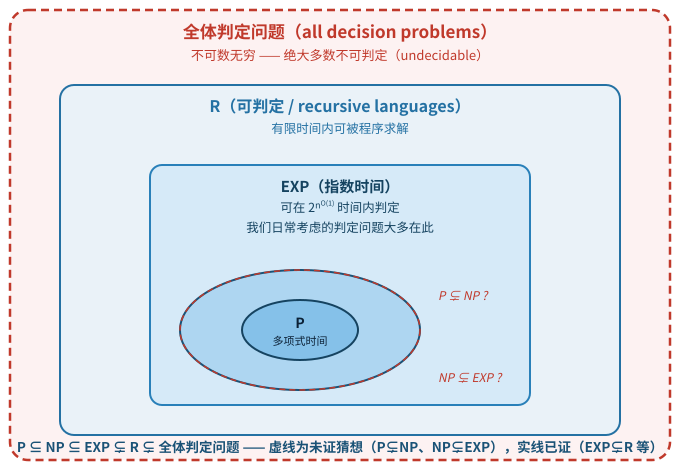

# Introduction to Algorithms: 6.006

## **[lecture]** Lecture 19: Complexity（复杂度——决策问题、可判定性与 P/NP/EXP）

Massachusetts Institute of Technology
Instructors: Erik Demaine, Jason Ku, and Justin Solomon

> MIT 6.006 Spring 2020, Lecture 19 讲义（对应视频：Complexity）——动态规划四讲（L16-L18）之后的独立收束讲：从"怎么设计快算法"转向"哪些问题根本不可能有快算法"。

🎥 *Demaine 开场如此定位本讲*："Today we're going to, in one lecture, cover an entire field, which is computational complexity... algorithms is mostly about showing how to solve problems well... And computational complexity is more about the lower bound side, proving that you can't solve a problem very well."（翻译：今天我们要用一节课覆盖一整个领域——computational complexity（计算复杂性）。算法课主要是展示如何把问题解决好；而计算复杂性更关心下界那一侧——证明你没法把某个问题解得很好。）

---

## **[section]** Decision Problems（决策问题）

- **Decision problem（决策问题）**：把每个 input（输入）指派为 YES（是，记 $1$）或 NO（否，记 $0$）的任务
- 每个输入要么是 NO input（NO 输入），要么是 YES input（YES 输入）

| Problem | Decision（对应决策） |
|---------|---------------------|
| **s-t Shortest Path**（$s$-$t$ 最短路径） | 给定 $G$ 中是否存在一条从 $s$ 到 $t$、weight（权重）至多为 $d$ 的 path（路径）？ |
| **Negative Cycle**（负环） | 给定 $G$ 中是否存在一个 negative weight cycle（负权环）？ |
| **Longest Simple Path**（最长简单路径） | 给定 $G$ 中是否存在一条 weight 至少为 $d$ 的 simple path（简单路径）？ |
| **Subset Sum**（子集和） | 给定整数集合 $A$，是否存在一个 sum（和）为 $S$ 的 subset（子集）？ |
| **Tetris**（俄罗斯方块） | 给定 board（游戏板）与方块出现序列，能否逐一放置 pieces（方块）坚持到序列结束而不堆顶？ |
| **Chess**（国际象棋） | 在给定局面中，某方能否 forced win（逼出胜局）？ |
| **Halting problem**（停机问题） | 给定 computer program（计算机程序）对给定输入是否会终止？ |

- **Algorithm/Program（算法/程序）**：一段 constant-length code（定长代码）——运行在 word size 为 $\Omega(\log n)$ bits 的 word-RAM 上——用来求解某个问题；即它对**每一个**输入都产生正确输出，且代码的长度与实例大小无关
- 若存在某个 program 能在 finite time（有限时间）内求解该问题，则称该问题是 **decidable（可判定的）**

> **[note] Note（译者注）:** 本讲把 L18 已露面的**决策问题（decision problem）**升格为全书主线：从今天起，难度分层都在"输入被分成 YES 与 NO 两类、答案只有一个是/否"的判定问题上进行。你在 L15-L18 接触的"问题"多是计算任务（求最短路径、求最优切法、排序），而 complexity theory（计算复杂性理论）把**验证型**复杂度类（NP 及其派生）只定义在决策问题上。为什么能这样收窄？**因为优化与判定可以互相归约**：想知道"$s$ 到 $t$ 的最短距离是多少"，可以反复问"是否存在长度 $\le d$ 的路径"（对 $d$ 做二分），$O(\log(\text{距离值域}))$ 次判定即可还原最优值——这正是本课早已用惯的二分搜索思想，也是 L18 注里 self-reducibility（自归约：反复调用判定 oracle 还原优化解）的同一条路子，此处不展开。反过来，任何判定问题也可以看成一个输出受限的优化问题。于是**判定问题虽然"更小"，却承载了所有计算问题的难度**——NP、NP-complete 这类**验证型**类只对判定问题定义（P/EXP/R 本身接受任意输出的问题，不限于判定），这是本讲推理的前提。

> 注意表格里最后三个问题（Tetris、Chess、Halting）故意**不是**来自算法课，而是来自现实游戏与逻辑：它们把"计算"从数组、图扩展到方块、棋盘与任意程序。表格的对角线信息是——**问题越"自由"，求解越难**：最短路径（受限的图结构）易解，Chess（几乎无结构的棋盘状态空间）极难，Halting（对任意程序推理）不可判定。直觉上，一个问题的输入**结构越丰富**（图、数组、网格），越容易找到高效算法；输入越"混沌"（任意代码、任意局面），越难。本讲后面会把这个直觉精确化：**结构 = 可归约性（reducibility）**。
>
> 逐行读这张表还能得到一张"难度光谱预览"：s-t Shortest Path 是 P 的（Dijkstra，本课已证）；Negative Cycle 是 P 的（Bellman-Ford 或 Floyd-Warshall 检测负环，L12/L14）；Longest Simple Path 是 NP-complete 的（第 4 页正式登场）——注意它与 Shortest Path 只有 simple 一词之差，却从易解跳到极难；Subset Sum 是 weakly NP-complete 的（L18 的伪多项式 DP 是它最后的温柔）；Tetris 是 NP-complete 的（判定版为"给定方块序列能否活下来"，Breukelaar–Demaine–Hohenberger 等 2003/2004 年证明，见 "Tetris is Hard, Even to Approximate"）；Chess 是 EXP-complete 的——注意是推广到 $n \times n$ 棋盘才算 EXP-complete，普通 8×8 棋盘是常数规模、理论上可蛮力穷举；Halting 根本**不可判定**——连"给够时间总能算完"都做不到。从 P 一路滑到不可判定，这张表就是本讲后三页内容的缩略地图，建议学完本讲后回来看一眼这张表，逐个确认每个问题的最终归属。
>
> 讲义里 "Algorithm = constant-length code（定长代码）"这个限定也值得停下来想一层：为什么要求**代码长度与实例无关**？因为在可判定性论证里，程序要能被"枚举"——如果允许程序随实例变长（比如把整个输入硬编码进程序），那么"每个输入配一个专属程序"会让"程序可数"的论证崩塌——输入（无穷 bit 串）不可数，而"输入 → 专属程序"的映射会把不可数多个输入映射成不可数多个求解器，计数论证随即失效。定长代码保证**一份代码处理无穷多个输入**，这才是"算法"的本义。而 decidable（可判定）的定义——"存在程序在有限时间内求解"——注意它**不要求时间上界**：跑 $2^{2^n}$ 年也算 decidable。这与你习惯的"高效"（polynomial time）是两回事：decidable 只管"能不能算完"，P/EXP 才管"算多久"。本讲接下来的路线就是逐级加资源约束，按"集合从小到大"排列为 $P \subseteq NP \subseteq EXP \subsetneq R$：P（多项式内算完）⊆ NP（证书可在多项式内验证）⊆ EXP（指数内算完）⊊ R（有限时间内算完）。注意方向：**P 是 NP 的子集**（能快解 ⟹ 能快验证），NP 又含于 EXP，R 最大——资源预算逐级放宽。

---

## **[section]** Decidability（可判定性）

- 每个 program 都是一段 finite（有限的）、定长的 bit（比特）串，即一个非负整数 $\in \mathbb{N}$
- 每个 problem 是一个函数 $p : \mathbb{N} \to \{0, 1\}$，即一个 infinite（无穷的）bit 串
- （program 的个数 $\mathbb{N}$，**countably infinite（可数无穷）**）小于（problem 的个数 $\mathbb{R}$，**uncountably infinite（不可数无穷）**）

🎥 *Demaine 用"无穷的大小不一样"点破这一步的直觉*："There are also infinitely many integers. So that maybe doesn't seem that deep. But there's a difference in infinitude... infinite strings of bits are what's called uncountable. I think the most intuitive way to see this is... if I put a decimal or a binary point in front, this encodes a real number between 0 and 1."（翻译：整数也有无穷多个，所以这看起来也许没什么了不起。但无穷与无穷之间有大小之分……无穷 bit 串被称为不可数无穷。最直观的理解方式是——在无穷 bit 串前面加一个小数点，它就编码了 0 到 1 之间的一个实数。）
- （证明用 Cantor's diagonalization argument（康托对角线论证），6.042 应该讲过）
- 这证明了：**大多数决策问题不能被任何程序求解（即 undecidable，不可判定）**

🎥 *Demaine 称这是本讲最令人吃惊的结论*："One result we'll prove today is that most problems actually have no algorithm, which is kind of shocking."（翻译：我们今天要证明的一个结论是——大多数问题实际上根本没有算法，这有点令人震惊。）
- 例如 Halting problem（停机问题）就不可判定（6.045 里有很多精彩的证明）
- 好在：我们通常思考的大多数问题在结构上都是 algorithmic（算法的），因而是可判定的

> **[note] Note（译者注）:** 这一页是全讲最重要的"数数"论证，值得用你在 6.042J 学过的集合基数（cardinality）概念重新走一遍——它本质上是一个 **Pigeonhole Principle（鸽巢原理）**的极限版本：要把不可数多个问题塞进可数个程序里，必然有大量问题没有对应程序。程序是有限 bit 串，全体有限 bit 串可以按长度排成 $\epsilon, 0, 1, 00, 01, \ldots$，与 $\mathbb{N}$ 一一对应——可数无穷。每个问题 $p : \mathbb{N} \to \{0,1\}$ 等价于一个"第 $i$ 位是 $p(i)$"的**无穷 bit 串**；全体无穷 $0/1$ 串的集合与实数集等势（把第 $i$ 位当作 $0.b_1 b_2 b_3 \ldots$ 的二进制小数，即得从无穷串到 $[0,1]$ 的满射；虽因 $0.0111\ldots = 0.1000\ldots$ 之类在可数多处重复而非单射，但等势结论不受影响，$\mathbb{R}$ 仍不可数）。于是"问题比程序多"——程序可数、问题不可数。**Cantor's diagonalization（康托对角线法）**正是你在 6.042J 见过的"实数不可数"证明的同一把刀：假定把全体无穷 $0/1$ 串排成列表，构造一个新串，其第 $i$ 位取反第 $i$ 个串的第 $i$ 位——它不在列表中任何位置，矛盾。这里"第 $i$ 个程序跑在第 $i$ 个输入上并取反其结果"是同一对角线的计算版本，它先给出一个具体的不可判定集合 $K$（第 $i$ 个程序在第 $i$ 个输入上不停机的那些 $i$）；停机问题另有自己的对角论证（见下句 $H$ 与 $D$），两者同源但并非同一证明：若存在程序 $H$ 判定停机，则构造 $D$：输入程序 $P$ 时，若 $H(P, P)$ 说"会停"就死循环、说"不停"就停机——$D(D)$ 无论 $H$ 怎么答都自相矛盾。这是 6.045 的核心内容，本讲只取结论：**对角线法的本质是"自我指涉 + 取反"**，与 6.042J 里证明 $\mathbb{N}$ 与 $\mathbb{R}$ 不等势、以及 Russell's paradox（罗素悖论，即"由所有不属于自身的集合构成的集合"是否属于自身——怎么答都矛盾）用的是同一个思想模板。直觉锚点：**"可数"意味着能逐个枚举（哪怕永不停歇），"不可数"意味着连枚举都做不到**——绝大多数问题是后者，它们连"等待答案"的资格都没有，更遑论多项式时间。
>
> 这个论证里有两个容易滑过的细节值得点出。**细节一：程序为什么能枚举？** "程序是有限 bit 串"不是一句废话——它排除了"程序库"里混入无限长代码的可能，保证了全体程序与自然数同势。所有你写过的 C/Python 程序、所有算法课的伪代码，落盘后都是有限字节串，都在这个可数集合里。**细节二：为什么停机问题"重要"？** 不可判定的问题有无穷多个（大多数问题都不可判定），但停机问题是其中**对人类最有用的一个**——编译器要判断程序是否死循环、操作系统要判断任务是否卡死、静态分析工具要证明程序终止性，全都绕不开它。它不可判定意味着：**不存在一个通用算法能对"所有程序 + 所有输入"判定是否停机**——注意是"通用"，单个具体程序是否停机往往可以人工证明（比如你的循环程序显然会停），难的是一把钥匙开所有锁。这正是"可判定性"研究的现实意义：**知道什么问题根本不可能自动化，与知道什么问题可以自动化，同等重要**——你不会再浪费时间写一个理论上不可能存在的调试器。而本讲接下来关心的是可判定但未必高效的那一层（R）内部——从下一节的 R/EXP/P 开始，问题的问法从「能不能算完」变成「要多少资源才能算完」，复杂度理论的主舞台就此拉开。

---

## **[section]** Decidable Decision Problems（可判定的决策问题）

- **R**：能在 finite time 内判定的问题（'R' 来自 recursive languages，递归语言）
- **EXP**：能在 exponential time（指数时间）$2^{n^{O(1)}}$ 内判定的问题（**我们日常考虑的大多数问题都在这里**）
- **P**：能在 polynomial time（多项式时间）$n^{O(1)}$ 内判定的问题（efficient algorithms（高效算法），本课焦点）

🎥 *Demaine 定义 P 与 EXP 时点明本课视角*："P is the set of all problems solvable in polynomial time. OK. So these are the problems that are efficiently solvable. P is set of all of them. And for contrast, EXP is the set of all problems solvable in exponential time. Exponential here means something like 2 to the n to the constant."（翻译：P 是所有能在多项式时间内求解的问题的集合——也就是能被高效求解的那些问题。作为对照，EXP 是所有能在指数时间内求解的问题的集合；这里的指数大致是 $2^{n^{O(1)}}$ 的意思。）
- 这些集合两两不同：$P \subsetneq EXP \subsetneq R$（由 time hierarchy theorems（时间谱系定理）保证，见 6.045）
- 例如 Chess 属于 $EXP \setminus P$

> 类谱系示意（自绘）：P ⊊ NP ⊊ EXP ⊊ R ⊊ 全体判定问题；其中 P ⊊ EXP 与 EXP ⊊ R 已被证明，P ⊊ NP 悬而未决（$P \ne NP$ 仅是普遍猜想）。

> **[note] Note（译者注）:** 这张"三层蛋糕"是理解全部复杂度理论的坐标轴。**R**（recursive languages，递归语言）是"理论上能算完"的全部问题——存在某个程序、不限时间地给出正确答案。**EXP** 是"$2^{n^{O(1)}}$ 能算完"的问题。**P** 是"$n^{O(1)}$ 能算完"的问题，即你在本课全学期设计的那些 efficient algorithm（高效算法）的集合。为什么说"我们日常考虑的大多数问题都在 EXP"？因为绝大多数算法问题的**暴力搜索**都落在指数规模内：最短路径枚举所有路径（至多指数条）、Subset Sum 枚举所有子集（$2^n$ 个）、Tetris 枚举所有方块序列——只要解空间规模不超过 $2^{n^{O(1)}}$、且每个候选可在多项式时间内检查，问题就落入 EXP。于是从 R 到 EXP 到 P，是对"需要多少资源"越来越紧的刻画。

> 关键论断是**包含关系严格**：$P \subsetneq EXP \subsetneq R$。P ⊊ EXP 与 EXP ⊊ R 都是**已证明的定理**（time hierarchy theorems（时间谱系定理）：给你更多时间，就能严格判定更多问题——证明思路是"给足时间后对角线化"，与上页停机问题的对角线同源，但要用可构造时间函数避开停机陷阱，细节在 6.045）。**注意：P ⊊ EXP 已被证明，但 P ⊊ NP 未被证明**——NP 夹在两者之间，它是不是真的比 P 大、比 EXP 小，就是 $P \stackrel{?}{=} NP$ 这个 open problem（开放问题），下一节会正式展开。**Chess 属于 $EXP \setminus P$ 是确定的定理而非猜想**：Chess（推广到 $n \times n$ 棋盘）已证 EXP-complete，即 EXP 中每个问题都能归约到它；又 $P \subsetneq EXP$ 已被时间谱系定理证明，故 EXP-complete 问题不可能在 P 中（否则 $P = EXP$，矛盾）——这条推论不依赖 $P \ne NP$，与 NP-complete 问题"是否在 P 中悬而未决"的情形形成鲜明对比。复杂度谱系常被画成同心圆（见上配图），记忆口诀：**P 内是"能快解"，EXP 内是"能暴力解"，R 内是"能解"，之外是"永不可解"**。你从 L18 带来的 Subset Sum 此刻有了精确坐标：它在 EXP 内（暴力枚举 $2^n$ 个子集）、确实在 NP 内（证书就是那个凑出目标和的子集 $A'$，验证器 $O(n)$ 求和即可）、若 $P \ne NP$ 则不在 P 内——下两页把 NP 的定义补齐。
>
> 这张谱系图里每个类都能在你已学的问题中找到"代表"：P 的代表满课都是——排序、Dijkstra、Bellman-Ford、Floyd-Warshall、LCS、所有 DP（L15-L18）；EXP 的代表是"暴力搜索版"——枚举所有子集的 Subset Sum、枚举所有顶点排列的 TSP；R 的代表是"任何有限时间算法"——包括那些要跑 $2^{2^n}$ 年的理论算法；R 之外的代表是停机问题。把类想成**资源预算**：P 的预算是最抠门的（多项式步数），EXP 的预算是"指数步数也认了"（$2^{n^{O(1)}}$ 里那个 $O(1)$ 常数可以是 2、3、任意大——所以 EXP 内部还分 $2^n, 2^{n^2}, 2^{n^3}, \ldots$ 无穷层级，时间谱系定理保证它们严格递增），R 的预算是"不限时间但必须停机"（连 $2^{2^n}$ 这样的双重指数也在 R 内，但已不属于 EXP）。**资源越多，能解的问题越多**——这就是时间谱系定理的直观内容，也解释了为什么包含关系是"一层套一层"而不是"互不重叠"：多给资源只会让你解更多，不会让你解更少。
>
> "Chess 是 EXP-complete"，这里有个值得拆开的词：**complete（完全）** 意味着它在 EXP 内部"最难"——EXP 里每个问题都能归约到它。类比 NP-complete：complete 类问题是一类中的"扛把子"，搞定一个就搞定整类。注意讲义对 Chess 的表述（$EXP \setminus P$）与对 Longest Simple Path/Tetris 的表述（"若 NP 中存在问题不属于 P，那么它们也不在 P 中"）语气不同——前者是**确定的**（EXP-complete + $P \subsetneq EXP$ 已证 ⇒ Chess $\notin P$ 无条件成立），后者是**条件性的**（依赖 $P \ne NP$）。这个细微差别值得记住：**凡是依赖 $P \ne NP$ 的结论都要加"若"字**，而依赖时间谱系定理的结论可以理直气壮。

---

## **[section]** Nondeterministic Polynomial Time（NP，非确定性多项式时间）

- **P** 是满足如下条件的决策问题集合：存在 algorithm $A$，使得对每个 size 为 $n$ 的 input $I$，$A$ 在 $I$ 上运行 $\mathrm{poly}(n)$ 时间并正确求解 $I$

- **NP** 是满足如下条件的决策问题集合：存在一个 **verification algorithm（验证算法）** $V$，它以问题的 input $I$ 和一条长度关于 $I$ 的 size 呈多项式关系的 certificate（证书）bit 串作为输入，使得：

  - $V$ 的运行时间总是关于 $I$ 的 size 呈多项式；
  - 若 $I$ 是 YES input，则存在某个 certificate $c$，使 $V$ 在输入 $(I, c)$ 上输出 YES；
  - 若 $I$ 是 NO input，则无论选哪个 certificate $c$，$V$ 在输入 $(I, c)$ 上总是输出 NO

- 你可以把 certificate 想成"$I$ 是 YES input"的 proof（证明）：若 $I$ 实际上是 NO input，则任何 proof 都不应该奏效

| Problem | Certificate（证书） | Verifier（验证器） |
|---------|----------------------|--------------------|
| **s-t Shortest Path** | 一条从 $s$ 到 $t$ 的 path $P$ | 把 $P$ 上的 weights 加起来，检查是否 $\le d$ |
| **Negative Cycle** | 一个 cycle $C$ | 把 $C$ 上的 weights 加起来，检查是否 $< 0$ |
| **Longest Simple Path** | 一条 path $P$ | 检查 $P$ 是否为 weight $\ge d$ 的 simple path |
| **Subset Sum** | 一个 items 集合 $A'$ | 检查 $A'$ 是否 $\subseteq A$，且其元素和是否为 $S$ |
| **Tetris** | 一串 moves（走法） | 检查这些 moves 是否允许 survival（存活） |

- **$P \subseteq NP$**：verifier $V$ 可以忽略 certificate 直接求解该实例
- **$NP \subseteq EXP$**：把所有可能的 certificates 都试一遍！至多 $2^{n^{O(1)}}$ 个，对每个都运行 verifier $V$
- **Open（未解）**：$P \stackrel{?}{=} NP$？$NP \stackrel{?}{=} EXP$？
- 大多数人认为 $P \subsetneq NP$（而 $NP$ 与 $EXP$ 的关系同样是开放问题），即 **generating（生成）解比 checking（检查）解更难**

🎥 *Demaine 说明这只是猜想而非定理*："People conjecture that P does not equal NP. It's sort of a standard conjecture in theoretical computer science. But we don't know how to prove whether P equals NP or does not equal NP."（翻译：人们猜想 $P \ne NP$。这是理论计算机科学里的一个标准猜想，但我们并不知道如何证明 $P = NP$ 还是 $P \ne NP$。）
- 你若能证明其中任何一个方向，人们会给你很多钱（$1M Millennium Prize（百万美元千禧年大奖））
- **我们为什么关心？** 若能证明某问题是 NP 中最难的问题，则当 $P \ne NP$ 时，该问题不可能在 polynomial time 内求解
- **如何比较问题的难度？Reductions（归约）！**

> **[note] Note（译者注）:** 6.006 给出了 NP 的两个等价定义——lucky algorithm（幸运猜测算法）/非确定性机版本与 verifier（验证器）版本，Demaine 自称更偏爱后者。本注取验证器作入口，因为它最不易误解：先把三个条件翻译成人话：① verifier 必须"快"（多项式）；② YES 实例必须**存在**一个能让 verifier 点头的证书（完备性 completeness：真命题有证明）；③ NO 实例必须**对所有**证书都摇头（可靠性 soundness：假命题无证明）。⚠️ 这里的 completeness/soundness 是证明系统术语，与后文 **NP-complete 的 complete（完全）** 完全是两回事，别混淆。"存在一个"与"对所有"这对量词组合，正是你在 6.042J 的逻辑课里反复用的 $\exists$ 与 $\forall$——NP 的实质就是 **$\exists$ 一个多项式长证书 + 多项式验证**。为什么叫"非确定性多项式时间"？历史名称来自等价定义：NP = 非确定性图灵机（每步可同时尝试所有分支）能在多项式时间内求解的问题——"猜一个证书再验证"恰好模拟了非确定性分支，两种定义等价。本课用验证定义是因为它**可操作**：上一张表展示了每个问题的验证器都极其简单——最短路径验证器 = 检查证书路径的每条边确实存在、且权重和 $\le d$；Subset Sum 验证器是"求和核对"；最长简单路径验证器 = 查重（保证 simple）+ 加权核对。**验证比求解容易**，这是 NP 的灵魂，也是 $P \ne NP$ 猜想的直觉来源：给你答案、检查它很容易（NP），但从零开始找答案很难（P）——大多数人相信"找"严格难于"查"。

> 注意三个认知陷阱：**陷阱一**：NP 不是"非多项式时间"的缩写！NP 里的问题目前**不知道**是否能在多项式时间内求解，但"不知道能不能快解"与"一定不能快解"是两回事——NP 只承诺"验证快"，不承诺"求解慢"。**陷阱二**：$P \subseteq NP$ 是**平凡的**（trivial）：求解器本身就是验证器——拿到证书不看，直接算出答案，答案对则输出 YES。这行包含关系不需要任何聪明证明。**陷阱三**：$NP \subseteq EXP$ 也几乎是平凡的：把所有可能的证书（至多 $2^{n^{O(1)}}$ 个）全部喂给多项式验证器，总时间仍是指数。**唯一不平凡、悬而未决的**是反方向 $P \supseteq NP$ 是否成立，即 $P = NP$？本页"大多数人认为 $P \subsetneq NP$"是一个**猜想**（conjecture），不是定理——这是计算机科学最重要、也最尴尬的开放问题（千禧年大奖问题之一，证明或证伪任一方向都值 100 万美元，且会天翻地覆：$P = NP$ 意味着所有"验证容易"的问题都能"快速求解"，密码学、优化、AI 全部重写）。一个连接点：你在 L18 学的 Subset Sum 正是 NP 的**明星成员**——它的验证器就是表里那行"检查候选子集是否 $\subseteq A$ 且元素和是否为 $S$"；而 L18 的核心结论"Subset Sum 的 DP 是伪多项式"此刻获得新解读：伪多项式算法只说明它在"数值大小"维度上可解，若 $P \ne NP$ 则不存在真正的多项式算法——下两页会看到 Subset Sum 其实是 NP-complete 的（weakly NP-complete），这条线索把 L18 与本讲焊在一起。
>
> 再补一层"为什么验证视角好用"的直觉：验证器把"难题"拆成了"容易的部分"——真正难的部分（找证书）被外包给了那个不存在的"魔法猜手"，剩下的（查证书）人人都会。这像极了你平时核对别人的证明：判断"这个证明对不对"（验证）通常远比自己"想出这个证明"（求解）容易。NP 的定义正是把这个日常经验提炼成数学：**若一个问题连"别人给答案后核对"都做不到多项式时间，它就连 NP 的门都进不去**（那些问题落在更难的类里，比如 EXP 中连验证都难的问题）。这张 5 问题验证表（最短路径/负环/最长简单路径/Subset Sum/Tetris）值得逐行默读一遍：每个验证器都是 $O(n)$ 或 $O(n^2)$ 的"死算"——没有任何一个需要"聪明"，这就是 NP 成员资格的典型画像：**问题本身可能极难，但它的 YES 证据总是"短且好查"**。对比之下，"证明一个实例是 NO"往往没有捷径（没有证书可查）——这正是 NO 侧与 YES 侧的本质不对称，也是 $NP$ 与 $coNP$（补类，本课不展开）分野的种子。

---

## **[section]** Reductions（归约）

🎥 *Demaine 强调归约是全课反复使用的老朋友*："What does as hard as mean? This is our good friend reductions. We talk about reductions a lot in this class. Reductions are the easy way to use algorithms. You just take your problem, and you reduce it to a problem you already know how to solve."（翻译："至少一样难"是什么意思？就是我们这位老朋友 reductions（归约）。本课我们经常提到归约——归约是用算法的省力方式：把你的问题拿过来，归约成一个你已知怎么解的问题。）

- 假设你想求解 problem $A$
- 一个办法是把 $A$ 转化成某个你知道怎么求解的 problem $B$
- 用解 $B$ 的算法求解，再用它算出 $A$ 的解
- 这叫做从 problem $A$ 到 problem $B$ 的 **reduction（归约）**（$A \to B$）
- 因为 $B$ 可以用来解 $A$，所以 **$B$ 至少和 $A$ 一样难**（$A \le B$，读作"$A$ 不比 $B$ 难"）
- 通用算法策略：**归约到一个你知道怎么解的问题**

| Problem $A$ | Conversion（转化） | Problem $B$ |
|-------------|--------------------|-------------|
| Unweighted Shortest Path（无权最短路径） | 给所有边赋相等权重 | Weighted Shortest Path（带权最短路径） |
| Integer-weighted Shortest Path（整数权最短路径） | 细分每条边 | Unweighted Shortest Path（无权最短路径） |
| Longest Simple Path（最长简单路径） | 把权重取负 | Shortest Path（最短路径） |

- 若 **NP 中的每个问题**都能多项式归约到 problem $A$，则称 $A$ 是 **NP-hard（NP 难）** 的
- 即 $A$ 至少和 NP 中每个问题一样难（对每个 $X \in NP$ 有 $X \le A$，即 $A$ 可以用来解每个 NP 问题）
- **NP-complete（NP 完全）** $= NP \cap NP\text{-hard}$
- 所有 NP-complete 问题彼此等价，即可以互相归约
- 第一个 NP-complete 问题？**NP 中的每个决策问题都能多项式归约到"判定一个逻辑电路是否可满足"**——这个问题叫 **Circuit SAT（电路可满足性）**
- Longest Simple Path 与 Tetris 都是 NP-complete 的，所以只要 $P \ne NP$（NP 中存在问题不属于 P），它们就不在 P 中
- **Chess 是 EXP-complete 的**：属于 EXP，且 EXP 中每个问题都能归约到它（所以 $\notin P$）

> **[note] Note（译者注）:** 归约（reduction）你在本课早已用过、L15 也点过名（reduce to a problem you already know），但本页才第一次把它形式化为 $A \to B$、$A \le B$ 的难度偏序。回看 L15-L18 的"把一个新问题化成已知问题"操作：把图问题化到 DAG shortest paths、把 Rod Cutting 化到更小规模的 Rod Cutting（那是 DP 的 self-reduction）。本页把它抽象成：若存在"把 $A$ 的每个实例多项式时间地改写成 $B$ 的实例、且保持 YES/NO 答案不变"的转换，则 $B$ 能解 $A$，记 $A \le B$。这个 $\le$ 是**难度偏序**：$B$ 在偏序中不矮于 $A$（$B$ 至少一样难）。表格三行都是你已掌握的算法，这里换个视角看它们其实是归约：无权 → 带权（$B$ 更一般，$A \le B$：赋等权即可）；带权 → 无权（**$B$ 更特殊却也能解 $A$**：把权为 $w$ 的边细分成 $w$ 条单位边，于是"细分"这个小把戏证明 integer-weighted $\le$ unweighted——**一个更弱的问题模型反而能解更强的问题**，因为细分把权重信息编码进图结构，这直观展示了归约的"编码力"（前提是权重规模多项式有界，否则细分边数指数膨胀，转换本身不再是多项式时间——这条与 L18 伪多项式主题遥相呼应））；最长路径 → 最短路径（取负权重，但注意这只在无负环时成立，否则最短路径算法失效——归约必须**保持答案**，任何破坏语义的转化都是无效归约，这是归约设计的头号陷阱）。

> NP-hard 与 NP-complete 的定义是层层加码：**NP-hard** = "能用来解 NP 中所有问题"（即对每个 $X \in NP$，$X \le A$）——它是 NP 难度的"上端"；**NP-complete** = NP-hard 且本身在 NP 中。于是若 $A$ 是 NP-complete 且你能找到 $A$ 的多项式算法，则把每个 NP 问题先归约到 $A$ 再解，就得到 $P = NP$——这就是"证明某问题是 NP-complete 等价于宣称它代表了整个 NP 类的难度"的含义。**为什么这有用？** 你若在现实中遇到一个 NP-complete 问题（下页的清单会告诉你这种问题到处都是），就知道不要浪费生命找它的多项式算法——转而接受指数/伪多项式/近似解。**归约的方向感**是新手最容易搞反的：想证明"我的问题 $A$ 难"，必须把**已知的难问题 $X$ 归约到 $A$**（$X \le A$，即 $A$ 至少和 $X$ 一样难）；反方向 $A \le X$（把 $A$ 归约到已知难问题）只说明"A 不比 $X$ 难"——这当然成立、却**证不出 $A$ 难**（正如任何可判定问题——包括所有 NP 问题——都能归约到停机问题，但那不说明它难）。想证明"我的问题 $A$ 容易"，则把 $A$ 归约到已知的易问题 $B$（$A \le B$）。归约的三种典型形态（以后在 6.045/6.046 会系统学）：**限制（restriction）**——$A$ 是 $B$ 的特例（无权最短路径是带权的特例）；**局部替换（gadget）**——把 $A$ 的结构单元替换成 $B$ 的小装置（$A \le B$ 是把 $A$ 实例翻译成 $B$ 实例；如把 3-SAT 归约到独立集时，把 $A$ 的每个子句替换成 $B$ 里的"三角形装置"）；**编码（encoding）**——把 $A$ 的语义编码进 $B$ 的输入（下页 Rectangle Packing 把整数 $a_i$ 编码成 $1 \times a_i$ 的矩形，就是编码型归约的绝佳例子）。
>
> 归约还是你判断"新问题能不能用老算法"的日常思维工具，只是本课以前没给它起名字：本页表格里把最长路径用负权化到最短路径（注意无负环才成立）、L18 把 Subset Sum 作为判定问题用伪多项式 DP 求解并讨论其 self-reducibility（自归约：反复调用判定 oracle 还原具体子集）、甚至分治法里"把大问题化到更小同类问题"都带归约的影子——区别只在于：**算法设计中的归约要求转换本身高效且保持最优解**，而复杂度理论中的归约只要求**保持 YES/NO 答案**（连解都不用恢复）。后者的要求更弱，所以能做更大胆的编码——这也是为什么复杂度归约能证明"看起来毫不相干的问题"难度相同（比如把整数划分编码成矩形装箱）。归约的复杂度预算也要记住：**归约转换本身必须是多项式时间的**，否则"用 B 的多项式算法解 A"的总时间可能不再是多项式（转换就要指数时间）。最后，一条把本页与 L18 接起来的暗线：Subset Sum $\le$ Knapsack（L18 recitation 提到背包是 Subset Sum 的推广——每个物品可带价值），而 3-Partition $\le$ Rectangle Packing $\le$ Jigsaw（下页的归约链）——NP-complete 问题之间织成一张网，证明一个等于证明一片，这正是"所有 NP-complete 问题彼此等价"的实际威力。

---

## **[section]** Examples of NP-complete Problems（NP 完全问题举例）

- **Subset Sum**（来自 L18）："weakly NP-complete（弱 NP 完全）"——正是这一点允许伪多项式时间算法存在，但除非 $P = NP$，否则不存在多项式算法
- **3-Partition（3-划分）**：给定 $n$ 个整数（$n$ 为 3 的倍数），能否把它们分成 $\frac{n}{3}$ 个和相等的三元组？（"strongly NP-complete（强 NP 完全）"：除非 $P = NP$，否则不存在伪多项式时间算法）
- **Rectangle Packing（矩形装箱）**：给定 $n$ 个矩形和一个 target rectangle（目标矩形），其中 target 的面积等于 $n$ 个矩形面积之和，问能否无重叠地装入
  - 从 **3-Partition 到 Rectangle Packing 的归约**：把整数 $a_i$ 转化为 $1 \times a_i$ 的矩形；把 target 矩形设为 $\frac{n}{3} \times \frac{\sum_i a_i}{3}$
- **Jigsaw puzzles（拼图）**：给定 $n$ 块可能有 ambiguous tabs/pockets（可互换的同形凸榫/凹槽）的拼图块，问能否拼合
  - 从 Rectangle Packing 归约：用唯一匹配的凸榫/凹槽强制拼出矩形与矩形边界；其余边界用同一个 ambiguous 凸榫/凹槽
- **n 个字符串的 Longest Common Subsequence（最长公共子序列）**
- **图中的 Longest Simple Path（最长简单路径）**
- **Traveling Salesman Problem（旅行商问题，TSP）**：访问给定图所有顶点（且回到起点）的最短路径（判定版：最小权重是否 $\le d$）
- **3D 中绕过障碍物的最短路径**
- **给定图的 3-coloring（3-着色）**（但 2-coloring 属于 P）
- **给定图中的最大 clique（团）**
- **SAT（可满足性问题）**：给定一个由 AND、OR、NOT 构成的 Boolean formula（布尔公式），是否存在赋值使其为真？例如 $x \land \lnot x$ 是 NO input
- **Minesweeper（扫雷）、Sudoku（数独）以及大多数 puzzle（谜题）**
- **Super Mario Bros.（超级马里奥）、Legend of Zelda（塞尔达传说）、Pokémon（宝可梦）以及大多数视频游戏都是 NP-hard 的（很多还更难）**

🎥 *Demaine 提到视频游戏其实落在更高的复杂度类*："Super Mario Brothers is NP-hard. Legend of Zelda is NP-hard. Pokemon is NP-hard. These problems are actually all a little bit harder than NP in a different class called PSPACE, which I won't go into."（翻译：超级马里奥是 NP-hard，塞尔达传说是 NP-hard，宝可梦是 NP-hard。这些问题其实比 NP 还要再难一点，落在另一个叫 PSPACE 的类里——这个我就不展开了。）

> **[note] Note（译者注）:** 这张清单是 NP-complete 问题的"名人堂"，也揭示了 complexity theory 最反直觉的事实：**NP 完全性不是病态理论的专利，而是日常世界的常态**。逐类拆解：
>
> ① **数值型**：Subset Sum 与 3-Partition 的对照是 L18 的直接延续。两者都是"分一堆数"，但 NP 完全性的**强弱**不同：Subset Sum 是 weakly NP-complete——它的困难全部来自那个可能指数大的目标值 $T$，若把输入整数写成 unary（一元编码），伪多项式 DP $O(nT)$ 就变成输入规模的多项式（L18 已详述）；3-Partition 是 strongly NP-complete——即使输入全用 unary 编码依然 NP-complete，不存在任何伪多项式算法（除非 $P = NP$）。直觉差别：Subset Sum 的"数字大小"是唯一的困难来源（数字小时问题平凡），3-Partition 的困难是**组合性**的（三个一组和相等，即使数字都很小也很难），所以 3-Partition 更"硬核"。这正是伪多项式算法只对 weakly NP-complete 问题有效的理论根据——L18 的 DP 能解 Subset Sum 是因为它恰好是 weak 的。
>
> ② **几何型**：从 3-Partition 到 Rectangle Packing 的归约（讲义 Reductions 表下方那行，方向是 3-Partition $\le$ Rectangle Packing）是"编码型归约"的范本：整数 $a_i$ 变成 $1 \times a_i$ 的矩形条。⚠️ **讲义此处尺寸有笔误，需勘误**：讲义写 target 为 $\frac{n}{3} \times \frac{\sum_i a_i}{3}$，但这个矩形的面积是 $\frac{n \sum_i a_i}{9}$，并不等于 $n$ 个矩形条的总面积 $\sum_i a_i$（除非 $n = 9$），与问题陈述"target 面积 = 各矩形面积之和"矛盾。**正确的构造**是：3-Partition 把 $n$ 个整数分成 $\frac{n}{3}$ 个三元组、每组和同为 $B = \frac{3\sum_i a_i}{n}$（由面积守恒反解：$\frac{n}{3}$ 组 × 每组和 $B$ = $\sum_i a_i$ ⟹ $B = \frac{3\sum_i a_i}{n}$）；把每个三元组的三根条**首尾相接排成一行**（行长 = 三元组和 = $B$），$\frac{n}{3}$ 行上下堆叠成 target = $\frac{n}{3}$（高）× $B$（宽）——面积 $= \frac{n}{3} \cdot \frac{3\sum_i a_i}{n} = \sum_i a_i$ ✓ 守恒。若存在 3-划分，每行放一个三元组即得无重叠装箱；反过来，任何装箱都必须排成恰好 $\frac{n}{3}$ 行（行高为 1、面积守恒强制行数固定），每行三条的和必须相等（否则行宽超出 $B$ 或留缝），于是答案保持。（3-Partition 标准定义还要求 $B/4 < a_i < B/2$——每个数大于四分之一 B 且小于一半 B，正是为强制"每组恰三条"；讲义省略了此条件，严谨的归约论证需要它。）**Rectangle Packing 到 Jigsaw** 的归约（方向是 Rectangle Packing $\le$ Jigsaw）展示"gadget"思想：唯一匹配的凸榫/凹槽强制拼图块拼成指定矩形（任何偏离都被榫槽结构否决），ambiguous 榫槽给其余自由度——用物理结构编码约束，是归约设计的艺术。
>
> ③ **图上**：Longest Simple Path、最大 clique、3-coloring、TSP 都在清单里。它们与你在本课学过的多项式图算法形成**精确对照**：最短路径（多项式）vs 最长简单路径（NP-complete）——差别只在"简单"二字——但"允许重复"并不会让问题变容易：在 DAG 中（无环，简单性自动满足）最长路径负权化后多项式可解；一般有环图里，允许重复的"最长 walk"遇到正环就无界、去掉正环又回到简单路径的难度。禁止重复的简单路径版本则要枚举顶点排列；2-coloring（多项式，BFS 二分图判定）vs 3-coloring（NP-complete）；"找最小生成树"（多项式）vs"找最大团"（NP-complete）。**同一个图，不同的问题难度天差地别**——难度不在图里，而在问题问的是什么。
>
> ④ **"视频游戏都是 NP-hard"**不是玩笑：2000 年代起研究者系统证明了 Tetris、Super Mario Bros.、Legend of Zelda、Pokémon 等游戏的判定版本是 NP-complete 甚至 PSPACE-complete（多项式空间可解的问题类；PSPACE 包含 NP，但"是否严格更难"与 P vs NP 一样未证，见 6.045）——方法就是把 SAT 或 3-Partition 的实例"编码"成游戏关卡（用关卡中的敌人、机关模拟逻辑门与计数）。这条研究方向叫游戏与谜题的复杂度分析（NP-hardness of games），有严肃的学术论文（如 Giovanni Viglietta 的 "Gaming is a hard job, but someone has to do it!"，Theory of Computing Systems 2014；Tetris 的 NP-完全性见 Demaine 等 2004 年 "Tetris is Hard, Even to Approximate"）。**它对你的意义**：NP 完全性是一种"结构诊断"，一旦你把自己面对的问题识别为 NP-complete（或 NP-hard），就该立刻转换策略——找近似算法、参数化算法、伪多项式算法（若 weakly NP-complete）、启发式、或约束求解器（SAT solver，现代工业界处理这类问题的实际主力，见下注）。
>
> ⑤ 清单最后一行"很多还更难"呼应第 3 页 Chess 的 EXP-complete：NP-complete 之上还有更难的类（PSPACE、EXP、不可判定），游戏恰好横跨全部层级——Tetris 是 NP-complete（其"能否活过给定方块序列"判定版），Chess 是 EXP-complete（讲义第 3 页，且已证 $\in EXP \setminus P$），围棋也在 EXP 级，而"给定规则能否让任意程序停下"（即做游戏 AI 的终极形态：判定对手程序是否停机）不可判定。**复杂度类不是一条线，而是一座越往上越陡的山。**

---

> **[note] Note（译者注，Circuit SAT 与第一个 NP-complete 问题）:** "第一个 NP-complete 问题"为什么是 Circuit SAT 而不是别的？这需要一点历史与机制。1971 年 Stephen Cook 发表 "The Complexity of Theorem-Proving Procedures"，证明了 **Circuit SAT / SAT 是 NP-complete**；次年 Richard Karp 发表 "Reducibility Among Combinatorial Problems"，把 Cook 的结果推广到 21 个问题（包括 clique、vertex cover、Hamiltonian cycle、TSP 等），从此 NP-completeness 成为一门"归约工业"。为什么 Circuit SAT 是自然的"第一个"？因为**任何 NP 问题的验证过程本身就是一个逻辑电路**：验证器 $V$ 在输入 $(I, c)$ 上运行多项式时间，而"多项式时间计算"可以被展平成多项式大小的布尔电路（电路模拟图灵机/程序的基本结论，CLRS §34.3 有构造（Lemma 34.6））；于是"$I$ 是 YES 实例"等价于"存在证书 $c$ 使电路输出 1"，即该电路可满足（satisfiable）。**每个 NP 问题都归约到 Circuit SAT，不需要任何问题特异的技巧**——归约就是"把验证器编译成电路"。这正是"第一个"的本质：它不是靠逐个构造归约拼出来的，而是**一次性覆盖所有 NP 问题**的通用论证。从 Circuit SAT 到 SAT 再到 3-SAT 只需局部改写（把电路门展开成子句、再把长句切成每句恰含三个文字的析取子句（整个公式是这些子句的合取）），于是 3-SAT 成为后续所有归约的"起点"（6.046/6.045 会把 3-SAT 归约到独立集、clique、vertex cover、Hamiltonian cycle……形成一张互相可达的归约网）。Cook 1971 与 Karp 1972 的论文动机都来自 logic（逻辑）与 automated theorem proving（自动定理证明）——Cook 想回答"定理证明能否高效机械化"，意外把 SAT 置于 NP 的核心，奠定了整个 NP 理论。**记忆锚点**：Circuit SAT 是 NP-complete 的**种子**，SAT/3-SAT 是归约的**枢纽**，Subset Sum/TSP/clique 等是**终端消费者**——归约方向永远从枢纽指向终端。
>
> 把 Cook 的证明再往深挖一层，你会看到"多项式时间计算 = 电路"这个等式的威力。验证器 V 在输入 $(I, c)$ 上跑 $T = n^{O(1)}$ 步；每一步（读内存、算术、跳转）都可以用一个小电路模拟（在 bit 级模型上每步 $O(1)$ 个门；在 word-RAM 上每步操作 $w$ 位字需 $\mathrm{poly}(w)$ 个门），把 $T$ 步串起来就得到总大小多项式于 $T$ 的电路，其输入是证书 $c$ 的各位。于是"存在使 V 输出 YES 的 $c$" = "存在使电路输出 1 的输入赋值" = 电路可满足。**注意这个归约不需要知道 V 内部在算什么**——任何多项式时间的 V 都能被"编译"成电路，这就是通用性（universality）的由来：一次证明，覆盖所有 NP 问题。Circuit SAT → SAT → 3-SAT 的链条把电路门（与/或/非）翻译成布尔子句：每个门变成若干子句约束其输入输出关系，再把长子句用辅助变量切成三个一组的短子句——翻译保持可满足性，且规模只多项式增长。3-SAT 之所以成为归约枢纽，是因为"三个文字一组"的形态足够刚性，方便后续归约构造 gadget（6.046 会把 3-SAT 归约到 Independent Set：每个子句放三个顶点、同子句内两两连边、跨子句连"互为否定"的边，求大小为 $m$（子句数）的独立集——可满足赋值 ↔ 大小 $m$ 的独立集一一对应）。
>
> 对你有实际价值的一点：**SAT 不只是理论玩具**。现代 SAT solver（CDCL 算法：冲突驱动子句学习 + 回溯，见 6.046 尾段或专门课程）能在秒到分钟级求解含数百万变量的工业实例——硬件验证（芯片等价性检查）、软件测试（符号执行）、调度、密码分析都把它当引擎用。理论说 SAT 是 NP-complete（最坏情况指数），实践却说"大多数实例其实好解"——两者不矛盾：NP-complete 保证的是**最坏情形**，真实世界的实例常有结构（稀疏、层次化）可被 CDCL 利用。这也是学习本讲最重要的心态校正：**"NP-complete"不是"别做了"的墓碑，而是"别找多项式最坏情况算法了，换武器"的路标**——伪多项式（Subset Sum）、参数化（固定参数 $k$、把指数限制在 $k$ 上）、近似、SAT 或整数线性规划（ILP）solver、启发式，都是武器库里的备选项。CLRS 第 34 章（NP-Completeness）对归约证明的书写规范有系统示范，适合作为本讲的延伸阅读。
>
> 一个具体的"证书 + 验证器"例子帮你看清 Circuit SAT 的机制：给定电路 $C$（由与/或/非门组成），YES 实例的证书就是一组让 $C$ 输出 1 的输入赋值；验证器只需按门逐层求值、$O(电路大小)$ 时间即可核对——证书"短且好查"，完美符合 NP 的画像。3-SAT 到 Independent Set 的归约也可配微型实例走一遍：子句 $(x \lor y) \land (\bar x \lor \bar y)$ 对应两个"三角形"（每条边两端分别来自两个子句、标互为否定的文字），$m = 2$；可满足赋值 $x=1, y=0$ 给出独立集 $\{x, \bar y\}$，大小恰为 2——每个子句恰贡献一个顶点。最坏情况指数 vs 工业可解，与快排最坏 $O(n^2)$ 却实际常用是同一类现象：**复杂度分析给最坏保证，工程实践吃平均/结构红利**。

---

> MIT OpenCourseWare — 6.006 Introduction to Algorithms, Spring 2020. Lecture 19 讲义翻译版。原文：https://ocw.mit.edu（Terms of Use 见 https://ocw.mit.edu/terms）
