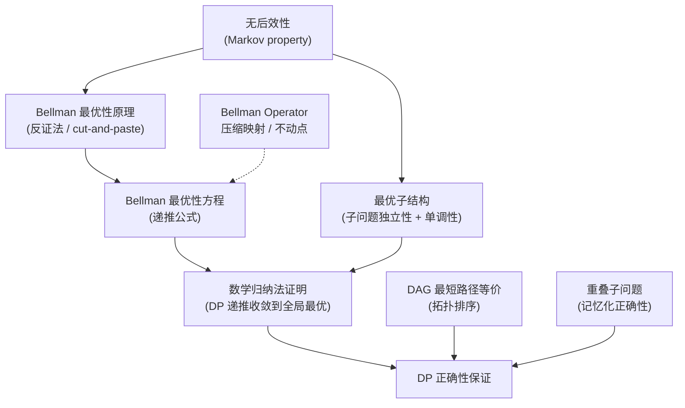

# 动态规划的数学正确性：完整理论推导

> **主题**：从第一性原理出发，完整证明动态规划（Dynamic Programming）的数学正确性——最优子结构、Bellman 最优性原理、递推收敛性。
> **风格**：定义 → 定理 → 证明，不跳步，每一步都有明确的数学依据。

---

## 目录

1. [问题的提出：DP 到底在"保证"什么？](#一问题的提出dp-到底在保证什么)
2. [形式化框架：多阶段决策过程](#二形式化框架多阶段决策过程)
3. [Bellman 最优性原理：核心定理](#三bellman-最优性原理核心定理)
4. [Bellman 最优性方程](#四bellman-最优性方程)
5. [最优子结构的数学刻画](#五最优子结构的数学刻画)
6. [DP 递推正确性：数学归纳法证明](#六dp-递推正确性数学归纳法证明)
7. [DP 与 DAG 最短路径的等价性](#七dp-与-dag-最短路径的等价性)
8. [重叠子问题与记忆化](#八重叠子问题与记忆化)
9. [总结：理论支柱全景](#九总结理论支柱全景)

---

## 一、问题的提出：DP 到底在"保证"什么？

动态规划常被描述为"将大问题分解为子问题，然后合并子问题的解"。但这个描述跳过了最关键的问题：

> **凭什么子问题的最优解组合起来一定是原问题的最优解？**

这就是最优子结构（optimal substructure）需要回答的问题。而进一步地：

> **按递推公式一步步算出来的值，凭什么一定是全局最优的？**

这需要 Bellman 最优性原理（Bellman's Principle of Optimality）和数学归纳法来保证。

下面我们从最底层的数学定义开始，逐层构建完整的证明链。

---

## 二、形式化框架：多阶段决策过程

### 定义 1（多阶段决策过程）

一个 **多阶段决策过程**（multi-stage decision process）是一个六元组 $\mathcal{M} = (S, A, T, C, s_0, F)$，其中：

| 符号                             | 名称                          | 说明                                           |
| ------------------------------ | --------------------------- | -------------------------------------------- |
| $S$                            | state space（状态空间）           | 所有可能状态的集合                                    |
| $A$                            | action space（行动空间）          | 所有可能决策的集合                                    |
| $T: S \times A \to S$          | transition function（状态转移函数） | $T(s, a) = s'$ 表示在状态 $s$ 执行行动 $a$ 后到达状态 $s'$ |
| $C: S \times A \to \mathbb{R}$ | stage cost（阶段代价函数）          | $C(s, a)$ 表示在状态 $s$ 执行行动 $a$ 的即时代价           |
| $s_0 \in S$                    | initial state（初始状态）         | 决策的起点                                        |
| $F \subseteq S$                | terminal states（终止状态集合）     | 决策过程结束的状态                                    |

> **注**：这是 **确定性**（deterministic）设定。随机版本将 $T$ 替换为转移概率 $P(s' \mid s, a)$，将 $C$ 替换为期望代价——但核心逻辑完全一致，不失一般性。

### 定义 2（有限 horizon 决策序列）

对于有限 horizon $N$（即最多 $N$ 步决策），一个 **决策序列**（decision sequence）是一个 $N$ 元组：

$$\pi = (a_0, a_1, \ldots, a_{N-1}) \in A^N$

给定 $\pi$ 和初始状态 $s_0$，状态序列 $\{s_t\}$ 由递推确定：

$$s_{t+1} = T(s_t, a_t), \quad t = 0, 1, \ldots, N-1$

总代价为：

$$J_\pi(s_0) = \sum_{t=0}^{N-1} C(s_t, a_t) + C_F(s_N)$

其中 $C_F(s_N)$ 是终端代价（terminal cost），当 $s_N \in F$ 时通常为 $0$，否则为 $+\infty$。

### 定义 3（策略）

一个 **策略**（policy）是一个函数 $\pi: S \to A$，为每个状态指定一个行动。这比"决策序列"更一般——它给出了**任何状态下**该做什么，而不仅仅是初始状态。

给定策略 $\pi$，从状态 $s$ 出发的 **值函数**（value function）为：

$$V^\pi(s) = C(s, \pi(s)) + V^\pi(T(s, \pi(s)))$

（递归定义，终端状态处 $V^\pi(s) = 0$）

### 定义 4（最优值函数与最优策略）

**最优值函数**（optimal value function）：

$$V^*(s) = \min_{\pi} V^\pi(s)$

**最优策略**（optimal policy）$\pi^*$ 满足：

$$V^{\pi^*}(s) = V^*(s), \quad \forall s \in S$

> 这就是 DP 的目标：求出 $V^*(s_0)$ 以及实现它的 $\pi^*$。

---

## 三、Bellman 最优性原理：核心定理

### 历史注记

Richard Bellman 在 1957 年出版的 *Dynamic Programming* 一书中首次系统地阐述了这一原理。他的核心洞察是：**在多阶段决策中，"最优"意味着无论过去的状态和决策如何，余下的决策必须构成从当前状态出发的最优策略。** Bellman 将这一观察命名为"最优性原理"（Principle of Optimality），并在此基础上导出了著名的 Bellman 方程。

值得注意的是，Bellman 本人并未将其称为"定理"（theorem），而是使用了"原理"（principle）一词——因为它更像一个建模准则：**如果你设计的状态定义满足无后效性，那么最优策略的子策略必然是最优的**。后来 Bertsekas 等学者给出了严格的形式化证明。

### 定理 1（Bellman 最优性原理，Bellman's Principle of Optimality, 1957）

> 设 $\pi^* = (a_0^*, a_1^*, \ldots, a_{N-1}^*)$ 是从初始状态 $s_0$ 出发的一个最优决策序列。则对任意 $k \in \{0, 1, \ldots, N-1\}$，**尾段**（tail sub-sequence）$(a_k^*, a_{k+1}^*, \ldots, a_{N-1}^*)$ 是从状态 $s_k^*$（由前 $k$ 步最优决策到达的状态）出发的最优决策序列。

### 证明（反证法 + cut-and-paste）

**Step 1**：假设定理不成立。

则存在某个 $k$，使得 $(a_k^*, \ldots, a_{N-1}^*)$ **不是**从 $s_k^*$ 出发的最优决策序列。

这意味着存在另一个决策序列 $(a_k', a_{k+1}', \ldots, a_{N-1}')$ 满足：

$$\sum_{t=k}^{N-1} C(s_t', a_t') + C_F(s_N') \;<\; \sum_{t=k}^{N-1} C(s_t^*, a_t^*) + C_F(s_N^*)$$

其中 $s_k' = s_k^*$（从同一状态出发），$s_{t+1}' = T(s_t', a_t')$。

**Step 2**：构造新的"混合"决策序列（cut-and-paste）。

$$\pi' = (a_0^*, a_1^*, \ldots, a_{k-1}^*, \; a_k', a_{k+1}', \ldots, a_{N-1}')$$

即前 $k$ 步照搬 $\pi^*$，第 $k$ 步起切换为更优的尾段。

**Step 3**：比较总代价。

由于前 $k$ 步的状态序列在 $\pi'$ 与 $\pi^*$ 下完全一致（转移函数是确定性的，且行动相同），前 $k$ 步的累积代价完全相同。因此：

```math
\begin{aligned}
J_{\pi'}(s_0) &= \underbrace{\sum_{t=0}^{k-1} C(s_t^*, a_t^*)}_{\text{前 k 步：与 } \pi^* \text{ 相同}} + \underbrace{\sum_{t=k}^{N-1} C(s_t', a_t') + C_F(s_N')}_{\text{尾段：严格优于 } \pi^*} \\
&< \sum_{t=0}^{k-1} C(s_t^*, a_t^*) + \sum_{t=k}^{N-1} C(s_t^*, a_t^*) + C_F(s_N^*) \\
&= J_{\pi^*}(s_0)
\end{aligned}
```

**Step 4**：得出矛盾。

$J_{\pi'}(s_0) < J_{\pi^*}(s_0)$ 意味着 $\pi'$ 比 $\pi^*$ 更优——这与 $\pi^*$ 是最优决策序列的假设矛盾。

因此假设不成立。$\square$

### 定理 1 的等价表述（策略形式）

> 若 $\pi^*$ 是最优策略，则对任意状态 $s$，从 $s$ 出发遵循 $\pi^*$ 的子路径也是从 $s$ 出发的最优路径。

**直觉**：无论你过去是如何到达当前状态的，从当前状态往后的最优决策只取决于当前状态本身，与历史路径无关。这就是 **无后效性**（Markov property）的实质。

### 一个重要的微妙之处（Bertsekas 的精细化）

Bertsekas 在其 *Dynamic Programming and Optimal Control* 中指出了 Bellman 原始表述的一个微妙问题：

> "最优性原理"并非普适真理——它只在状态定义**充分丰富**（sufficiently rich）时成立。如果状态遗漏了对未来决策有影响的信息，那么子策略可能不是最优的。

**例子**：假设你在一个图中找最短路径，但状态只记录"当前顶点"而不记录"已经访问过的顶点集合"（当问题要求每个顶点只能访问一次时）。那么从同一顶点出发的最优路径可能因为不同的访问历史而不同。此时 Bellman 原理"失效"——但这是因为状态定义不完整，而非原理本身有缺陷。

> **教训**：DP 能否应用，本质上取决于你能否找到正确的状态定义，使得无后效性成立。这是 DP 建模中最困难也最关键的一步。

---

## 四、Bellman 最优性方程

### 定理 2（Bellman 最优性方程，Bellman Optimality Equation）

最优值函数 $V^*(s)$ 满足以下函数方程（functional equation）：

```math
\boxed{V^*(s) = \min_{a \in A(s)} \left\{ C(s, a) + V^*(T(s, a)) \right\}}
```

其中 $A(s) \subseteq A$ 是在状态 $s$ 下可行的行动集合。

### 证明

由最优值函数的定义：

```math
\begin{aligned}
V^*(s) &= \min_{\pi} V^\pi(s) \\
&= \min_{\pi} \left[ C(s, \pi(s)) + V^\pi(T(s, \pi(s))) \right] \quad \text{(值函数的递归定义)}
\end{aligned}
```

将外部的最小化分解为两步——先选第一步行动 $a$，再选剩余策略：

```math
V^*(s) = \min_{a \in A(s)} \; \min_{\pi: \pi(s)=a} \left[ C(s, a) + V^\pi(T(s, a)) \right]
```

对于内部最小化，约束 $\pi(s)=a$ 只固定了第一步的行动。由 **定理 1**（Bellman 最优性原理），从 $T(s, a)$ 往后的最优策略与"是如何到达 $T(s, a)$ 的"无关。因此：

```math
\min_{\pi: \pi(s)=a} V^\pi(T(s, a)) = V^*(T(s, a))
```

代入即得：

```math
V^*(s) = \min_{a \in A(s)} \left\{ C(s, a) + V^*(T(s, a)) \right\}
```

$\square$

### 关键洞察

Bellman 方程将一个 $N$ 步的优化问题**压缩为一步**：你只需要选择当前行动 $a$，然后假设剩余问题已经被最优地解决了（$V^*(T(s, a))$ 告诉你剩余代价）。这就是 DP 的"分治"本质。

> **类比**：这就像数学归纳法的递推步——假设 $k-1$ 步的问题已解决（归纳假设），那么 $k$ 步的问题只需做一步决策。

### Bellman 方程的唯一性

一个自然的问题是：Bellman 方程是否有多个解？答案是：

> 在有限 horizon、有限状态空间下，满足终端条件 $V_0(s) = C_F(s)$ 的 Bellman 方程的解是**唯一的**——它就是 $V^*$。

**证明思路**：Bellman 递推 $V_k = \mathcal{T}(V_{k-1})$ 定义了一个算子 $\mathcal{T}$（称为 Bellman operator）。可以证明 $\mathcal{T}$ 是**压缩映射**（contraction mapping）——在 sup-norm 下是 $\gamma$-contraction（当 $\gamma < 1$ 时）或在有限 horizon 下经过恰好 $N$ 步精确收敛。由 Banach 不动点定理，$V^*$ 是唯一不动点。这一理论在无限 horizon 折扣 MDP 中尤为重要。

---

## 五、最优子结构的数学刻画

### 定义 5（最优子结构，Optimal Substructure）

称一个优化问题 $\mathcal{P}$ 具有 **最优子结构**，如果其最优解 $x^*$ 可以递归地表示为子问题最优解的函数：

$$x^* = \Phi(x_1^*, x_2^*, \ldots, x_m^*)$$

其中：

- $\mathcal{P}_1, \mathcal{P}_2, \ldots, \mathcal{P}_m$ 是 $\mathcal{P}$ 划分出的子问题
- $x_i^*$ 是子问题 $\mathcal{P}_i$ 的最优解
- $\Phi$ 是组合函数（composition function），将子问题解"粘合"为原问题解

### 最优子结构的三个必要条件

#### 条件 1：子问题的独立性（Independence of Subproblems）

子问题的最优解选择 **不互相冲突**。形式化：子问题的解空间 $\mathcal{X}_1 \times \mathcal{X}_2 \times \cdots \times \mathcal{X}_m$ 上，原问题的可行域是笛卡尔积的一个子集，且约束在不同子问题间是可分离的（separable）。

$$\mathcal{X}_{\text{feasible}} = \{(x_1, \ldots, x_m) \in \mathcal{X}_1 \times \cdots \times \mathcal{X}_m \mid g_i(x_i) \leq 0 \text{ 仅涉及 } x_i\}$$

> **反例**：最长简单路径（Longest Simple Path）不具备最优子结构，因为子路径的选择会互相约束——子路径 $P_1$ 使用的顶点不能被子路径 $P_2$ 重复使用。这就是子问题**不独立**。

#### 条件 2：组合函数的单调性（Monotonicity of $\Phi$）

更优的子问题解不能导致更差的原问题解。形式化：

若 $x_i'$ 优于 $x_i^*$（对某个子问题 $\mathcal{P}_i$），且其他子问题解不变，则：

$$\Phi(x_1^*, \ldots, x_i', \ldots, x_m^*) \text{ 优于 } \Phi(x_1^*, \ldots, x_i^*, \ldots, x_m^*)$$

> 这保证了"每个子问题取最优 → 整体最优"的推理链条不中断。

#### 条件 3：无后效性（Markov Property / No Aftereffect）

子问题的解一旦确定，**后续决策不依赖到达该子问题的路径**。

形式化：设两个不同的决策历史 $h_1, h_2$ 均到达同一状态 $s$。则从 $s$ 出发的最优决策序列与使用了 $h_1$ 还是 $h_2$ 无关。

```math
V^*(s \mid h_1) = V^*(s \mid h_2) = V^*(s)
```

> 状态 $s$ 包含了所有对未来决策有影响的信息——这恰恰是"状态"概念的定义要求。

### CLRS 中的经典正反例对比

| 问题            | 最优子结构？ | 原因                                 |
| ------------- |:------:| ---------------------------------- |
| **最短路径**（无负环） | ✅ 是    | 最短路径的任何子路径也是最短路径（cut-and-paste 可证） |
| **最长简单路径**    | ❌ 否    | 子路径合并时顶点可能冲突，不满足独立性                |
| **矩阵链乘法**     | ✅ 是    | 最优括号化方案的任何子链也是最优括号化的               |
| **0-1 背包**    | ✅ 是    | 剩余容量下的最优选择独立于已选物品（当状态包含剩余容量时）      |
| **无界背包**      | ✅ 是    | 同上                                 |
| **分数背包**      | ✅ 是    | 贪心即可，子结构更直接                        |
| **装配线调度**     | ✅ 是    | 到达每个装配站的最短时间只取决于前一站，不关心如何到达前一站     |
| **编辑距离**      | ✅ 是    | 最优编辑序列的任意前缀也是对应子串间的最优编辑            |

### 实例验证：最短路径的最优子结构

**命题**：设 $P = (v_0, v_1, \ldots, v_k)$ 是从 $v_0$ 到 $v_k$ 的最短路径（按边权和）。则对任意 $0 \leq i < j \leq k$，子路径 $P_{ij} = (v_i, v_{i+1}, \ldots, v_j)$ 是从 $v_i$ 到 $v_j$ 的最短路径。

**证明**（cut-and-paste）：

假设 $P_{ij}$ **不是** $v_i$ 到 $v_j$ 的最短路径。则存在路径 $P_{ij}'$ 满足：

$$w(P_{ij}') < w(P_{ij})$$

构造新路径（"剪切—粘贴"）：

$$P' = (v_0, \ldots, v_{i-1}) \circ P_{ij}' \circ (v_{j+1}, \ldots, v_k)$$

计算权重：

```math
\begin{aligned}
w(P') &= w(v_0 \leadsto v_{i-1}) + w(P_{ij}') + w(v_{j+1} \leadsto v_k) \\
&< w(v_0 \leadsto v_{i-1}) + w(P_{ij}) + w(v_{j+1} \leadsto v_k) \\
&= w(P)
\end{aligned}
```

$w(P') < w(P)$，与 $P$ 是最短路径矛盾。$\square$

**注**：这个证明的每一步——子问题定义（$v_i$ 到 $v_j$ 的最短路径）、组合函数（路径拼接 $\circ$）、矛盾构造（替换子路径）——对应了最优子结构的完整逻辑。

---

## 六、DP 递推正确性：数学归纳法证明

前面证明了 Bellman 方程是 $V^*$ 必须满足的**必要条件**。现在需要证明：**按 Bellman 方程递推计算出的值确实等于最优值**——这是充分性。

### 6.1 DP 算法（Value Iteration 形式）

**设定**：有限 horizon $N$，状态空间 $S$ 为有限集。

**算法**：

```math
\begin{aligned}
&V_0(s) = C_F(s), \quad \forall s \in S \quad \text{(初始化: 0 步剩余的最优代价)} \\
&\text{for } k = 1, 2, \ldots, N: \\
&\quad V_k(s) = \min_{a \in A(s)} \left\{ C(s, a) + V_{k-1}(T(s, a)) \right\}, \quad \forall s \in S
\end{aligned}
```

最终输出 $V_N(s_0)$ 作为原问题的最优值。

### 定理 3（DP 递推的正确性）

对所有 $k \in \{0, 1, \ldots, N\}$ 和所有 $s \in S$，$V_k(s)$ 等于从状态 $s$ 出发在**恰好 $k$ 步**内到达终止状态的最小总代价。特别地，$V_N(s_0)$ 是原问题（$N$ 步 horizon）的全局最优值。

### 证明（对 $k$ 进行数学归纳）

---

**基始（Base Case）：$k = 0$**

$V_0(s)$ 被定义为终端代价 $C_F(s)$：

- 若 $s \in F$（已是终止状态），0 步即可"到达"终止，代价为 $C_F(s)$（通常 = 0）。$\checkmark$
- 若 $s \notin F$，无法在 0 步内到达终止状态，任何 0 步"决策序列"的代价应为 $+\infty$。此时 $C_F(s) = +\infty$。$\checkmark$

命题对 $k = 0$ 成立。

---

**归纳假设（Inductive Hypothesis）**

假设对某个 $k-1 \geq 0$，命题成立：$\forall s \in S$，$V_{k-1}(s)$ 是从 $s$ 出发在 $k-1$ 步内的最小总代价。

---

**归纳步骤（Inductive Step）：证明对 $k$ 成立**

考虑任意状态 $s \in S$。任何从 $s$ 出发的 $k$ 步决策序列 $(a_0, a_1, \ldots, a_{k-1})$ 的总代价为：

```math
J(s; a_0, \ldots, a_{k-1}) = C(s, a_0) + \sum_{t=1}^{k-1} C(s_t, a_t) + C_F(s_k)
```

其中 $s_1 = T(s, a_0)$，$s_{t+1} = T(s_t, a_t)$。

观察：**从 $t = 1$ 开始的 $k-1$ 步**正好构成从 $s_1 = T(s, a_0)$ 出发的一个 $k-1$ 步决策序列。由归纳假设：

```math
\min_{a_1, \ldots, a_{k-1}} \left[ \sum_{t=1}^{k-1} C(s_t, a_t) + C_F(s_k) \right] = V_{k-1}(s_1) = V_{k-1}(T(s, a_0))
```

因此，**在第一步选择 $a_0$ 的条件下**，后续最优代价为 $V_{k-1}(T(s, a_0))$。第一步选择 $a$ 后能获得的最小总代价为：

$$C(s, a) + V_{k-1}(T(s, a))$$

在所有可行行动中取最小值：

```math
\min_{a \in A(s)} \left\{ C(s, a) + V_{k-1}(T(s, a)) \right\}
```

这恰好是算法中 $V_k(s)$ 的定义。因此 $V_k(s)$ 确实等于从 $s$ 出发在 $k$ 步内的最小总代价。

---

**归纳完成**

由数学归纳法原理，命题对所有 $k \in \{0, 1, \ldots, N\}$ 成立。$\square$

### 6.2 为什么归纳法在这里"刚好能工作"？

关键在于 **阶段编号（stage index）是一个天然的良基序（well-founded order）**：

- 每一步递推将 $k$ 减少 1
- $k$ 是非负整数，严格递减的序列必然有限步终止
- 递推到 $k=0$ 时到达基始，不再需要递归

这种 **"参数严格递减 + 基始明确定义"** 的结构正是数学归纳法的标准适用场景。它与你在 6.042J 中学过的 **强归纳法**（strong induction）和 **结构归纳法**（structural induction）是同一原理的不同形式。

---

## 七、DP 与 DAG 最短路径的等价性

### 定理 4（DP-DAG 等价性）

任何具有最优子结构的有限确定性 DP 问题等价于在对应的 **状态转移有向无环图**（state-transition DAG）上求解最短路径。

### 7.1 状态转移图的构造

给定 DP 问题 $\mathcal{M} = (S, A, T, C, s_0, F)$，构造有向图 $G = (V, E, w)$：

- **顶点集** $V = S$（每个状态对应一个顶点）
- **有向边集** $E = \{(s, T(s, a)) \mid s \in S, a \in A(s)\}$（每个可行的状态转移对应一条边）
- **边权重** $w(s, s') = \min_{a: T(s, a) = s'} C(s, a)$（到达 $s'$ 的最小单步代价；若无可行行动则 $w = +\infty$）

### 7.2 为什么这个图一定是 DAG？

在多阶段决策过程中，决策按 **阶段**（stage）进行。状态可以按"剩余步数"分层：

- 第 $k$ 层的状态：还需要恰好 $k$ 步到达终止
- 从第 $k$ 层到第 $k-1$ 层的转移对应一步决策

有向边总是从高层指向低层（$k \to k-1$），不存在从低层回到高层的边。因此图中不可能有环。$\square$

### 7.3 DAG 最短路径算法 = DP

对于 DAG，最短路径可按 **逆拓扑序**（reverse topological order）计算：

```math
\text{dist}(s) = \begin{cases}
0 & \text{if } s \in F \\
\displaystyle\min_{(s, s') \in E} \left\{ w(s, s') + \text{dist}(s') \right\} & \text{otherwise}
\end{cases}
```

这正是 DP 的 Bellman 递推！拓扑序保证了在计算 $\text{dist}(s)$ 时，所有后继 $s'$ 的值已经确定。

> **结论**：DP 本质上就是 **在有向无环图上按拓扑序求解最短路径**。这是 DP 正确性的另一个独立证明——DAG 最短路径的正确性由图的拓扑性质保证。

### 7.4 处理环：从 DAG 到一般图

当状态转移图中存在环时怎么办？有两种标准策略：

| 策略                        | 适用场景            | 方法                                                                 |
| ------------------------- | --------------- | ------------------------------------------------------------------ |
| **阶段展开**（Stage Unfolding） | 有限 horizon      | 将状态按时步复制：$(s, t)$ 是一个新状态，转移 $(s, t) \to (s', t+1)$ 消除所有环           |
| **Value Iteration**       | 无限 horizon / 折扣 | Bellman operator $\mathcal{T}$ 是 $\gamma$-contraction，反复迭代收敛到唯一不动点 |

> 离散数学（6.042J）的 **良基序**（well-foundedness）概念在此再次出现：只要存在一个严格递减的度量函数（如"剩余步数"），递推就必然终止。

---

## 八、重叠子问题与记忆化

### 定义 6（重叠子问题，Overlapping Subproblems）

考虑 DP 问题的递归分解树。如果 **不同的递归分支包含相同的子问题实例**（相同状态），称该问题具有重叠子问题性质。

### 定理 5（记忆化的正确性）

对具有重叠子问题的 DP，记忆化（memoization）不改变计算结果，且将时间复杂度从 $O(b^N)$（分支因子 $b$，深度 $N$）降至 $O(|S| \cdot |A|)$（状态数 × 每状态可行行动数）。

### 证明

**（1）正确性**：

记忆化只是将每个状态 $s$ 的值 $V(s)$ 在首次计算后存入缓存。当第二次遇到相同状态 $s$ 时直接返回缓存值。

需要证明：**从同一状态 $s$ 出发的最优值不依赖到达 $s$ 的路径**。

这恰是 **无后效性**（条件 3）的直接推论：状态 $s$ 包含了所有对未来决策有影响的信息，不同的到达路径不影响从 $s$ 出发的最优值。因此缓存值是有效的。$\square$

**（2）复杂度**：

每个状态最多被计算一次（之后命中缓存），每次计算枚举所有可行行动。状态数 $|S|$，行动数 $|A|$，总计算次数 $\leq |S| \cdot |A|$。$\square$

### 记忆化 vs 自底向上 DP

| 方面   | 记忆化（Top-down）                 | 自底向上 DP（Bottom-up） |
| ---- | ----------------------------- | ------------------ |
| 计算顺序 | 按需递归，深度优先                     | 显式按拓扑序迭代           |
| 空间   | 只计算实际可达的状态                    | 可能计算所有状态（包括不可达的）   |
| 递归开销 | 有函数调用开销                       | 无递归开销，循环高效         |
| 数学本质 | **完全相同**——都是按拓扑序求解 Bellman 方程 |                    |

### 重叠子问题与最优子结构的区分

CLRS 明确指出，动态规划要求问题**同时**具备两个性质：

- **最优子结构**：保证"正确的解可以通过组合子问题的最优解得到" → 这是 **正确性** 的保证
- **重叠子问题**：保证"递归会反复遇到相同的子问题" → 这是 **效率** 的保证（将指数降为多项式）

> 如果只有最优子结构但没有重叠子问题 → 分治算法（如归并排序）即可
> 如果只有重叠子问题但没有最优子结构 → DP 无法使用（如最长简单路径）
> **两者兼备 → 动态规划**

---

## 九、总结：理论支柱全景

### 定理/原理的关系图



### 核心证明链总结

| 定理/原理                     | 它保证什么                     | 证明方法                  | 连接到的知识       |
| ------------------------- | ------------------------- | --------------------- | ------------ |
| **Bellman 最优性原理**         | 最优策略的任何尾段也是最优的            | 反证法（cut-and-paste）    | 6.042J 反证法   |
| **Bellman 最优性方程**         | 最优值函数的递推关系                | 最小化分解 + 无后效性          | 函数方程         |
| **最优子结构**                 | 子问题最优 → 全局最优              | cut-and-paste + 单调性验证 | 分治算法正确性      |
| **DP 递推正确性**              | 按 Bellman 方程迭代确实收敛到 $V^*$ | 数学归纳法（对阶段数 $k$）       | 6.042J 归纳法   |
| **DP-DAG 等价**             | DP 就是 DAG 最短路径            | 拓扑排序 + 阶段展开           | 图论 + CSAPP 图 |
| **记忆化正确性**                | 缓存不改变结果                   | 无后效性（路径无关）            | 复杂度分析        |
| **Bellman Operator 压缩映射** | 无限 horizon 下的收敛性          | Banach 不动点定理          | 实分析（100B 前置） |

### 一句话总结

> **DP 正确性的终极保证是**：无后效性确保状态包含了所有决策相关信息，Bellman 最优性原理确保"每步最优 → 整体最优"的推理链条不断裂，数学归纳法确保递推计算的值恰好是全局最优值——这三个支柱互为支撑，缺一不可。

### 延伸：DP 的三大经典形式

| 形式                     | 公式                                                               | 对应算法                |
| ---------------------- | ---------------------------------------------------------------- | ------------------- |
| **Value Iteration**    | $V_{k+1}(s) = \min_a \{C(s,a) + \gamma V_k(s')\}$                | Bellman-Ford, 网格 DP |
| **Policy Iteration**   | 策略评估 + 策略改进交替                                                    | Howard's algorithm  |
| **Linear Programming** | $\max \sum_s V(s) \text{ s.t. } V(s) \leq C(s,a) + \gamma V(s')$ | 单纯形法求解 MDP          |

---

## 附录 A：与 6.042J 离散数学的连接

| DP 概念          | 6.042J 对应概念                 | 章节         |
| -------------- | --------------------------- | ---------- |
| 数学归纳法证明 DP 正确性 | 强归纳法（Strong Induction）      | Chapter 5  |
| 状态转移 DAG 无环    | 良基序（Well-founded Order）     | Chapter 2  |
| Bellman 递推的终止性 | 结构归纳法（Structural Induction） | Chapter 6  |
| 反证法证明最优子结构     | Proof by Contradiction      | Chapter 1  |
| 重叠子问题 → 多项式时间  | 递归关系求解（Recurrences）         | Chapter 20 |
| 最短路径 vs 最长简单路径 | 图论基本定义                      | Chapter 10 |

## 附录 B：与 CLRS 的对应

| 本节内容                 | CLRS 章节                                   |
| -------------------- | ----------------------------------------- |
| 最优子结构定义与证明           | §15.1（Rod Cutting）, §15.3（Elements of DP） |
| 重叠子问题                | §15.3                                     |
| 记忆化 vs 自底向上          | §15.1, §15.3                              |
| 最长简单路径反例             | §15.3                                     |
| 矩阵链乘法（最优子结构）         | §15.2                                     |
| DAG 最短路径             | §24.2                                     |
| Bellman-Ford（DP 含负边） | §24.1                                     |

## 附录 C：关键概念中英对照

| English                           | 中文              |
| --------------------------------- | --------------- |
| dynamic programming               | 动态规划            |
| optimal substructure              | 最优子结构           |
| Bellman's principle of optimality | Bellman 最优性原理   |
| Bellman optimality equation       | Bellman 最优性方程   |
| Markov property / no aftereffect  | 无后效性 / Markov 性 |
| overlapping subproblems           | 重叠子问题           |
| memoization                       | 记忆化             |
| cut-and-paste argument            | 剪切—粘贴论证         |
| state space                       | 状态空间            |
| action space                      | 行动空间            |
| transition function               | 状态转移函数          |
| stage cost                        | 阶段代价            |
| value function                    | 值函数             |
| optimal policy                    | 最优策略            |
| mathematical induction            | 数学归纳法           |
| well-founded order                | 良基序             |
| topological order                 | 拓扑序             |
| DAG (Directed Acyclic Graph)      | 有向无环图           |
| Bellman operator                  | Bellman 算子      |
| contraction mapping               | 压缩映射            |
| Banach fixed-point theorem        | Banach 不动点定理    |
| value iteration                   | 值迭代             |
| policy iteration                  | 策略迭代            |

---

> **构建于 2026-08-01** · 方舟计划 · 动态规划理论基石
> **主要参考**：Bellman (1957) *Dynamic Programming*; Bertsekas (2017) *Dynamic Programming and Optimal Control* Vol. I; CLRS (4th ed.) Chapter 15; MIT 6.006 & 6.046 Lecture Notes on DP; MIT 6.042J Mathematics for Computer Science
